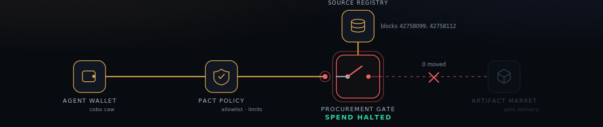
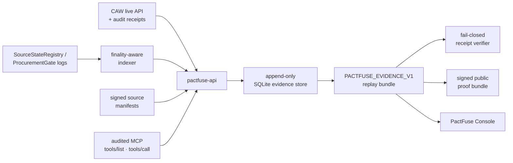

<div align="center">

# ⚡ PactFuse

**A fail-closed circuit breaker for AI-agent spending.**

PactFuse re-checks what an agent is buying at the **instant of payment**, on-chain, and cuts the payment **before any token moves** if the source turned unsafe. Every claim replays signed on-chain evidence you can re-verify live.

[**▶ Live Console**](https://pactfuse-console.vercel.app) · [Verify it yourself](#-verify-it-yourself) · [How it works](#-how-it-works) · [中文文档](./README.zh-CN.md)

<br/>

[](https://pactfuse-console.vercel.app)
&nbsp;
&nbsp;
&nbsp;

<br/>



</div>

---

## 🔥 The problem

AI agents are starting to spend money on their own (data, models, tools, compute) through wallets like the **Cobo Agentic Wallet (CAW)**. But what an agent buys is only as safe as its **source**, and a source can turn unsafe in the gap **between "decide to buy" and "actually pay."**

That gap (check at decision, use at payment) is a classic time-of-check / time-of-use hole, and it is exactly where real money is lost today:

- a price oracle gets manipulated right before a bot acts on it,
- a vendor's bank details are swapped between invoice approval and payout (BEC fraud),
- a package or model is flagged malicious (a CVE, a backdoor) right after it was pulled in.

Checking once, at decision time, is not enough. **You have to re-check at the moment money moves, and refuse if anything changed.**

## ✅ What PactFuse does

PactFuse binds every spend to its sources on-chain, then re-checks freshness at the payment instant:

- **source challenged → trip**: the on-chain `ProcurementGate` cuts the payment before any token moves (`0 moved`),
- **source clean → settle**: the gate pays on-chain and releases the paid artifact, consumed through an audited MCP surface,
- **wrong target → deny**: the wallet-policy layer refuses the call before it ever reaches the chain.

Every run exports one replayable, Ed25519-signed proof bundle, and the [live console](https://pactfuse-console.vercel.app) re-verifies it against the public chain right in your browser.

> **The whole idea in one line:** stop trusting "it was safe when I decided." Make the payment itself conditional on the source being safe *right now*.

## 🧱 Two enforcement layers

| Layer | Where it runs | What it enforces | If it fails |
|---|---|---|---|
| **Pact policy** (CAW) | off-chain, before signing | who/what you may pay: target allowlist, function selectors, params, usage limits | wrong target → `live_denied`, no transaction ever exists |
| **Procurement gate + Source registry** | on-chain, at the payment call | is every bound source still fresh | challenged source → trip, `0 moved` |

One layer is soft and flexible (policy, off-chain, denies before the chain). The other is hard and verifiable (a contract, on-chain, the last-moment backstop). Both are fail-closed: anything missing or unsafe means *don't pay*.

---

## 🎬 Live demo

### → **[pactfuse-console.vercel.app](https://pactfuse-console.vercel.app)**

A zero-build, dependency-free console that replays the verified Base Sepolia session. Pick one of three risk scenarios and run it; every step binds to a real evidence row (tx hashes, block numbers, CAW audit evidence):

| Scenario | What you watch | Outcome |
|---|---|---|
| 🔴 **Unsafe source → auto-interrupt** | a pinned source is challenged on-chain; the breaker throws open | `SPEND HALTED` · `0 moved` |
| 🟢 **Fresh source → settle & deliver** | allowance verified, gate settles, artifact released via MCP lease | `DELIVERED` |
| 🟡 **Wrong target → policy denial** | a call outside the Pact allowlist is refused by CAW server-side | `DENIED` (no tx ever exists) |

**It is not just a replay.** The console reads the live chain in front of you, keyless:

- **Self-test** (press `T`) re-fetches every real transaction from a public Base Sepolia RPC and shows it is *still* confirmed on-chain (tens of thousands of confirmations).
- **Live state** (press `G`) reads the gate and registry directly via `eth_call`: the challenged source returns `Challenged`, its spends return `Tripped`, the clean spend returns `Settled`.

Open your browser Network tab to watch the real RPC calls. No backend, no keys, nothing to trust but the chain. (`?fail=1` shows the transport-drop / retry path; full reduced-motion, keyboard, and mobile support included.)

---

## 🧩 How it works

PactFuse models a purchase as a **source-bound lease**:

1. A source issuer registers a **signed source manifest** in `SourceStateRegistry`.
2. A buyer agent registers a **spend bound to that source set** through CAW. Registration just commits the terms on-chain; no money moves yet.
3. At the payment call, the gate re-checks the bound sources:
   - **challenged before settlement** → `ProcurementGate` **trips** the spend before any token moves,
   - **still fresh** → the gate **settles** and unlocks a **paid artifact**.
4. The clean lease executes through an **audited MCP** surface, bounded to the exact pinned tool manifest.
5. Every step is exported as `PACTFUSE_EVIDENCE_V1` for replay, offline verification, and Judge Check review.



---

## 🔐 Verified on-chain evidence

All values below are from **one clean live session** on Base Sepolia (chain id `84532`), re-verifiable against the public RPC.

Session `0x4686a9d093cce9159d3b38085b7dab31fcf394488d956850bbc533b478c1965c`

| Item | On-chain |
|---|---|
| Agent wallet (CAW, EVM) | [`0x233bea…be6c`](https://sepolia.basescan.org/address/0x233bea7367aa309d8e8abc4906f7cd7159adbe6c) |
| `ProcurementGate` (the breaker) | [`0x5ea6ca…f89f`](https://sepolia.basescan.org/address/0x5ea6ca349b44c4d5e5c7414ca5e8177b4517f89f) |
| `SourceStateRegistry` | [`0xad8673…063f`](https://sepolia.basescan.org/address/0xad8673a2bbd4f3d45678bd8cd929de70b0bd063f) |
| `PaidArtifactMarket` | [`0x5fffc5…f32a`](https://sepolia.basescan.org/address/0x5fffc5f978d19083f91e8b7224d0975e0663f32a) |
| Payment token (mock ERC-20, mUSD) | [`0x17b27a…3675`](https://sepolia.basescan.org/address/0x17b27ade48c881a562eff03649a9162606ff3675) |
| CAW `approve` tx → gate | [`0x782c1b…68c0e`](https://sepolia.basescan.org/tx/0x782c1b34b1fd7f488cbc04527470e622068b1cd6fc736b9efc6cd1846e768c0e) · block 42758057 |
| CAW `activate_tool` settlement (`SpendSettled` + `Transfer`) | [`0x517acd…23950`](https://sepolia.basescan.org/tx/0x517acd3bfd4ff1fe9bbddd353f5eef4603e1198803c0b66c34a52a7bdde23950) · block 42758072 |
| CAW wrong-target deny (no tx) | op `0x540d73…0efe1`, status `live_denied` |
| Lease execution | run `0x4ddfae…0c41e5`, status `succeeded_live_mcp_transcript` |

Full signed artifacts are checked in under [`docs/evidence/live/0x4686…965c/`](docs/evidence/live/0x4686a9d093cce9159d3b38085b7dab31fcf394488d956850bbc533b478c1965c) (`live-preflight.json`, `public-claim.json`, `proof-bundle.json`, `manifest.json`).

---

## ✅ Verify it yourself

Three independent ways, in increasing rigor:

**1. In the browser (live chain, keyless).** Open the [console](https://pactfuse-console.vercel.app), press `T` (Self-test) and `G` (Live state), and watch the real Base Sepolia RPC calls in your Network tab re-confirm the evidence is still on-chain.

**2. Offline (no API, no chain access).** Recompute every hash and check the Ed25519 verifier attestation against the trusted key hash:

```sh
PACTFUSE_TRUSTED_PROOF_KEY_HASHES=0x25b4b8faa1bc2ae3984f983f106c465ed607ce2eb5bf4356c000735f7002fec9 \
node scripts/verify-live-artifacts.mjs \
  docs/evidence/live/0x4686a9d093cce9159d3b38085b7dab31fcf394488d956850bbc533b478c1965c
```

Expected: `"ok": true` with `publicClaimHash 0xd624…87c7`, `proofBundleHash 0x01e0…9668`.

**3. Run the suites** (233 API · 114 verifier · 7 schema · 5 MCP · 9 contract tests):

```sh
pnpm install && pnpm build && pnpm test && pnpm test:contracts
```

See fail-closed in action: the checked-in pending receipt is rejected by the full verifier and only accepted structurally:

```sh
node packages/verifier/pactfuse-verify-receipt.mjs --schema-only docs/evidence/receipt-pack.pending.example.json
node packages/verifier/pactfuse-verify-receipt.mjs            docs/evidence/receipt-pack.pending.example.json
```

---

## 🚀 Quick start

> Requirements: Node.js ≥ 22, pnpm 10.30, [Foundry](https://book.getfoundry.sh/) for Solidity tests.

```sh
pnpm install
pnpm build
pnpm test
pnpm test:contracts
```

**Run the console** (zero-build, served from the repo root so it can load the checked-in proof artifacts):

```sh
pnpm demo:console
# → http://127.0.0.1:8123/apps/fusebox/live/
```

**Run the API** locally (insecure-token bypass is for local dev only):

```sh
export PACTFUSE_ALLOW_INSECURE_MISSING_ROLE_TOKENS=true
export PACTFUSE_MCP_AUDIT_TOKEN=local-mcp-audit
export PACTFUSE_GATE_INGEST_TOKEN=local-gate-ingest
export PACTFUSE_CAW_INGEST_TOKEN=local-caw-ingest
pnpm dev:api   # http://127.0.0.1:8787  ·  /healthz · /readyz · /api/v1/openapi.json
```

The judge runner starts the backend when possible, prints evidence links, and **exits non-zero while proof gates are still closed**, demonstrating the fail-closed default:

```sh
./demo/run-judge.sh
```

---

## 🧱 Tech stack

| Layer | Stack |
|---|---|
| **Wallet / custody** | Cobo Agentic Wallet (`@cobo/agentic-wallet`): Pact policy, contract calls, audit export |
| **Smart contracts** | Solidity + Foundry on Base Sepolia |
| **API** | Hono · Zod · viem · `@noble/curves` · `node:sqlite` (append-only evidence store) · pino |
| **Agent surface** | Model Context Protocol (`@modelcontextprotocol/sdk`): audited tool leases |
| **Proof** | Canonical-JSON hashing + Ed25519 attestation · fail-closed replay verifier |
| **Console** | Zero-build vanilla ES modules + CSS (no framework, no dependencies) |
| **Tooling** | Turborepo · pnpm workspaces · TypeScript · Vitest · GitHub Actions |
| **Deploy** | Vercel (static console) |

---

## 📁 Project structure

```
.
├── apps/
│   ├── pactfuse-api/        # Hono API · evidence store · indexer · CAW ingest · verifier adapter · SSE
│   └── fusebox/live/        # PactFuse Console: zero-build, evidence-backed demo
├── contracts/               # Foundry: SourceStateRegistry · ProcurementGate · PaidArtifactMarket · SourceFreshGuard
├── packages/
│   ├── evidence-schema/     # Shared Zod schemas + canonical JSON hashing
│   ├── verifier/            # verifyEvidence() + CLI receipt / replay verifier
│   ├── pactfuse-mcp/        # MCP adapter that audits tool calls back into PactFuse
│   └── guard-kit/           # Reusable source-fresh settlement scaffold
├── pact-template/           # Pact templates + A/B/C spend-series renderer
├── docs/evidence/           # Evidence rules, claim gates, and the signed live proof artifacts
└── scripts/                 # live-env-report · live-smoke · verify-live-artifacts · serve-demo
```

---

## 🛡️ Trust model & claim boundaries

PactFuse derives public claims from **evidence, never from pitch preference**. Fresh deployments boot fail-closed (`claimMode=simulated`, `winnerClaimAllowed=false`). There is no manual override: the only path to a public claim is passing every live gate in one session.

### Claim ledger

| Capability | Status |
| --- | --- |
| CAW-authorized spend: `approve` + `activate_tool` settle through CAW under an approved Pact | ✅ live · Base Sepolia |
| Source-bound trip **before payment** (`ProcurementGate`) | ✅ live |
| On-chain settlement + ERC-20 balance-delta proof | ✅ live · mock ERC-20 |
| Wrong-target policy denial (CAW, server-side) | ✅ live · `live_denied` |
| Audited MCP lease-execution transcript | ✅ live |
| Signed proof bundle + offline re-verification | ✅ live |
| Real-value / official **USDC** settlement | 🔴 not claimed · mock-ERC20 fallback |
| **Mainnet** | 🔴 testnet only (Base Sepolia) |
| Multi-agent (separate buyer / seller) identity | 🔴 single CAW wallet (recorded floor) |
| Independent third-party MCP / artifact workload | ⏳ team-operated demo infra |

**What this is, and is explicitly not:**

- ✅ Real CAW authorization + audit receipts, real on-chain `approve` / settlement txs, real policy denial.
- ❌ **Not mainnet.** All execution is on Base Sepolia testnet.
- ❌ **Not official USDC, not real-value settlement.** The official USDC probe failed for this environment; the recorded fallback is a self-deployed mock ERC-20 (mUSD), and the schema **rejects** any attempt to present it as USDC (`live-mock-erc20-fallback`).
- ❌ **Not multi-agent identity.** One CAW owner wallet under one approved Pact.
- ❌ **Not third-party workload.** The MCP / artifact endpoints are team-operated demo infra.
- ❌ **Not proof of issuer honesty.** Issuer-declared source freshness is an explicit trust boundary (only the source's registered issuer can challenge or revoke it; a production hardening path is a multi-challenger / staked watcher network).

The app never holds a raw private key; funds move only through CAW under an approved Pact. All demo value is testnet-only. See [`docs/evidence/`](docs/evidence) for the claim-mode rules, custody boundary, and receipt-verifier spec.

---

## 🤖 AI tools & third-party disclosure

Per hackathon rules, everything external is declared.

- **APIs / services**: Cobo Agentic Wallet API (`api.agenticwallet.cobo.com`); Base Sepolia public JSON-RPC; Cloudflare quick tunnels for the team-operated demo MCP / artifact endpoints; GitHub Actions for CI; Vercel for the console.
- **SDKs / libraries**: `@cobo/agentic-wallet`, Hono, Zod, viem, `@noble/curves`, `@modelcontextprotocol/sdk`, pino, Vitest, Turborepo, pnpm, tsx, TypeScript, Foundry.
- **AI tools**: large parts of this codebase were written with AI coding agents **under human direction**: OpenAI Codex (backend) and Anthropic Claude Code (review, release verification, frontend / console, this README). All behavior claims are backed by the machine-verifiable evidence above. The test suites, the fail-closed verifier, and the signed proof bundle are the source of truth, not authorship.

---

## 📄 License

No license file is checked in yet; treat the repository as **all-rights-reserved** until a license is added.

<div align="center">
<br/>
<sub>Built for the AI × Web3 Agentic Builders Hackathon · Cobo Agentic Wallet track · <a href="./README.zh-CN.md">中文文档</a></sub>
</div>
