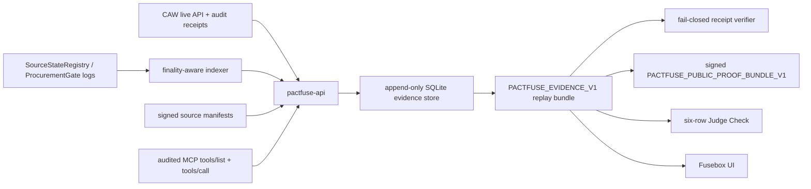

# PactFuse

<p align="center">
  <strong>Contract-enforced source fuse behind a Cobo Pact target allowlist.</strong>
</p>

<p align="center">
  An AI agent buys a tool lease with funds it controls through Cobo Agentic Wallet (CAW).
  If the pinned source turns unsafe before settlement, the on-chain <code>ProcurementGate</code> trips the spend <em>before any token moves</em>.
  If the source stays fresh, the gate settles, the agent unlocks the paid artifact, and consumes it through an audited MCP surface.
  Every step is exported as one replayable, cryptographically signed evidence bundle.
</p>

<p align="center">
  
  
  
  
  
  
</p>

> **中文 TL;DR（评委速览）**
> PactFuse 让 agent 用自己的 CAW 钱包真实地花钱采购工具租约：spend 与来源绑定，结算前来源被挑战就在付款前熔断；来源新鲜则链上结算并交付付费 artifact，agent 通过受审计的 MCP 调用消费它。
> 已在 Base Sepolia 完成全程真实执行：真实 CAW 授权/审计回执 + 真实链上 approve/结算交易 + mock ERC20 (mUSD) 结算（**非官方 USDC、非主网**）。
> 全部证据打包为带 Ed25519 签名的 proof bundle，已 check-in 到仓库，可一条命令**离线复验**——见下方 [Verify It Yourself](#verify-it-yourself)。

## Contents

- [Hackathon Submission](#hackathon-submission)
- [Verified Live Evidence](#verified-live-evidence)
- [Verify It Yourself](#verify-it-yourself)
- [Where CAW Sits In The Code](#where-caw-sits-in-the-code)
- [What Is PactFuse?](#what-is-pactfuse)
- [Claim Status And Boundaries](#claim-status-and-boundaries)
- [Architecture](#architecture)
- [Quick Start](#quick-start)
- [API Surface](#api-surface)
- [Evidence And Verification](#evidence-and-verification)
- [Configuration](#configuration)
- [Smart Contracts](#smart-contracts)
- [Frontend Preview](#frontend-preview)
- [Security Model And Risk Boundary](#security-model-and-risk-boundary)
- [Third-Party APIs, SDKs, And AI Tools](#third-party-apis-sdks-and-ai-tools)
- [Development](#development)
- [Documentation](#documentation)
- [License](#license)

## Hackathon Submission

- **Event**: AI × Web3 Agentic Builders Hackathon — **Cobo 赛道｜Agentic Economy × Cobo Agentic Wallet**
- **Direction**: 03 — Agent Resource Procurement (agent autonomously procures data/API/tool resources)
- **One-liner**: a fail-closed procurement gate that lets an agent spend real funds on source-bound tool leases, trips unsafe spends before payment, and proves every claim with replayable on-chain + CAW evidence.

Why CAW is load-bearing here, not decorative:

- The agent wallet is a CAW wallet. Every funds-moving call (`ERC20.approve`, `ProcurementGate.activateTool`) is submitted **through the CAW API under an approved Pact** — never with a raw private key held by the app.
- The Pact policy (target allowlist, function selectors, request limits, policy digest) is part of the proof: evidence binds each operation to the active policy digest, and a **wrong-target call is denied by CAW** and recorded as live deny evidence.
- CAW audit logs are ingested as raw receipts and re-fetched at claim time; hand-entered receipts cannot reach public-proof status.

## Verified Live Evidence

All rows below are from one clean live session and were re-verified against the public Base Sepolia RPC before this README was written. Chain id `84532`.

Session: `0x4686a9d093cce9159d3b38085b7dab31fcf394488d956850bbc533b478c1965c`

| Item | Value |
| --- | --- |
| Agent wallet (CAW, EVM) | [`0x233bea7367aa309d8e8abc4906f7cd7159adbe6c`](https://sepolia.basescan.org/address/0x233bea7367aa309d8e8abc4906f7cd7159adbe6c) |
| CAW wallet UUID | `a82e780a-a5be-45a3-9156-a00002a29bac` |
| Approved Pact | `13af0a59-ceef-44c7-8892-f193a63cffcc`, policy digest `0x5df870fba4398c9cbc4868b15c77fad9feaf4a6763a66016ce4e2e4b3217c66d` |
| `ProcurementGate` | [`0x5ea6ca349b44c4d5e5c7414ca5e8177b4517f89f`](https://sepolia.basescan.org/address/0x5ea6ca349b44c4d5e5c7414ca5e8177b4517f89f) |
| `SourceStateRegistry` | [`0xad8673a2bbd4f3d45678bd8cd929de70b0bd063f`](https://sepolia.basescan.org/address/0xad8673a2bbd4f3d45678bd8cd929de70b0bd063f) |
| `PaidArtifactMarket` | [`0x5fffc5f978d19083f91e8b7224d0975e0663f32a`](https://sepolia.basescan.org/address/0x5fffc5f978d19083f91e8b7224d0975e0663f32a) |
| Payment token (mock ERC20 mUSD) | [`0x17b27ade48c881a562eff03649a9162606ff3675`](https://sepolia.basescan.org/address/0x17b27ade48c881a562eff03649a9162606ff3675) |
| CAW approve tx (`Approval` to gate) | [`0x782c1b34b1fd7f488cbc04527470e622068b1cd6fc736b9efc6cd1846e768c0e`](https://sepolia.basescan.org/tx/0x782c1b34b1fd7f488cbc04527470e622068b1cd6fc736b9efc6cd1846e768c0e) (block 42758057) |
| CAW `activate_tool` settlement tx (`SpendSettled` + `Transfer`) | [`0x517acd3bfd4ff1fe9bbddd353f5eef4603e1198803c0b66c34a52a7bdde23950`](https://sepolia.basescan.org/tx/0x517acd3bfd4ff1fe9bbddd353f5eef4603e1198803c0b66c34a52a7bdde23950) (block 42758072) |
| CAW wrong-target deny (live policy denial, no tx) | operation `0x540d73d7c31006119c3727eca9dfb3382bf7beca9b5cc649f5165e902d40efe1`, status `live_denied` |
| Lease execution | run `0x4ddfae80cf4da2fae2f979aa150cfab3774a0dd09b6dbb111447e11c660c41e5`, status `succeeded_live_mcp_transcript` |

<details>
<summary>Session setup transactions (sources and source-bound spends)</summary>

| Step | Tx | Block |
| --- | --- | --- |
| Register clean source | [`0x592c68f87aa302c821d4cded2fa5d15016ce12ce8dca09872951247aa6982321`](https://sepolia.basescan.org/tx/0x592c68f87aa302c821d4cded2fa5d15016ce12ce8dca09872951247aa6982321) | 42757986 |
| Register bad source | [`0xc6f72fd37a71b58cc938db19d8c2c4f4857e844a6acc0589fc03383a6d3febad`](https://sepolia.basescan.org/tx/0xc6f72fd37a71b58cc938db19d8c2c4f4857e844a6acc0589fc03383a6d3febad) | 42758000 |
| Register spend C (clean, settles) | [`0x1881621a6bd689381c24dee1de2d33af571630de6966caca868a0f6451f2453c`](https://sepolia.basescan.org/tx/0x1881621a6bd689381c24dee1de2d33af571630de6966caca868a0f6451f2453c) | 42758013 |
| Register spend A (challenged, trips) | [`0xcaeb853d812ce0ab6cdf489aef2b8ed89502acbdd4b65cd3149892e8752d4826`](https://sepolia.basescan.org/tx/0xcaeb853d812ce0ab6cdf489aef2b8ed89502acbdd4b65cd3149892e8752d4826) | 42758025 |
| Register spend B (challenged, trips) | [`0x742291b86fef85875193aff1b206052c1e5e45f7098fc05cb685162aabfe1097`](https://sepolia.basescan.org/tx/0x742291b86fef85875193aff1b206052c1e5e45f7098fc05cb685162aabfe1097) | 42758036 |

</details>

The full signed proof artifacts for this session are checked in under
[`docs/evidence/live/0x4686…965c/`](docs/evidence/live/0x4686a9d093cce9159d3b38085b7dab31fcf394488d956850bbc533b478c1965c)
(`live-preflight.json`, `public-claim.json`, `proof-bundle.json`, `manifest.json`).

## Verify It Yourself

Offline, no API and no chain access required — recomputes every hash in the exported artifacts and checks the Ed25519 verifier attestation against the trusted key hash:

```sh
PACTFUSE_TRUSTED_PROOF_KEY_HASHES=0x25b4b8faa1bc2ae3984f983f106c465ed607ce2eb5bf4356c000735f7002fec9 \
node scripts/verify-live-artifacts.mjs \
  docs/evidence/live/0x4686a9d093cce9159d3b38085b7dab31fcf394488d956850bbc533b478c1965c
```

Expected: `"ok": true` with `publicClaimHash 0xd624…87c7`, `proofBundleHash 0x01e0…9668`, `artifactManifestHash 0x32b1…256e`.

Spot-check the chain independently: open the two transaction links above — the approve tx is `from` the agent wallet `to` the mock ERC20, the settlement tx is `from` the agent wallet `to` `ProcurementGate`.

Run the test suites (233 API + 114 verifier + 7 schema + 5 MCP + 9 contract tests):

```sh
pnpm install && pnpm build && pnpm test && pnpm test:contracts
```

Confirm the fail-closed posture on a fresh boot: the checked-in receipt example is *rejected* by the full verifier and only accepted structurally:

```sh
node packages/verifier/pactfuse-verify-receipt.mjs --schema-only docs/evidence/receipt-pack.pending.example.json
node packages/verifier/pactfuse-verify-receipt.mjs docs/evidence/receipt-pack.pending.example.json
```

## Where CAW Sits In The Code

| Concern | Location |
| --- | --- |
| CAW live client (`@cobo/agentic-wallet` SDK; wallet identity, Pact submit/get, contract calls, transfers, audit export; trusted-host pinning to `api.agenticwallet.cobo.com` / `api.cobo.com` / `api.dev.cobo.com`) | [`apps/pactfuse-api/src/services/providers.ts`](apps/pactfuse-api/src/services/providers.ts) (`createCoboAgenticWalletClient`) |
| CAW evidence flow (identity probe + live recheck, contract-call submit, allowance verification, raw audit-receipt ingest and canonicalization, policy digest binding, deny handling) | [`apps/pactfuse-api/src/services/service.ts`](apps/pactfuse-api/src/services/service.ts) (`probeCawLiveIdentity`, `submitCawLiveContractCall`, `verifyCawAllowance`, `ingestCawReceiptBundle`) |
| CAW HTTP routes | `POST /api/v1/caw/live/identity/probe`, `/caw/live/contracts/call`, `/caw/live/allowances/verify`, `/caw/receipts/ingest`, `/caw/operations/build` in [`apps/pactfuse-api/src/app.ts`](apps/pactfuse-api/src/app.ts) |
| Pact policy templates (target allowlist + selector rules rendered per spend series) | [`pact-template/`](pact-template) |
| CAW configuration | `PACTFUSE_CAW_LIVE_API_URL/KEY/WALLET_ID`, `PACTFUSE_CAW_EXPORT_URL/API_KEY/WALLET_ID` — see [Configuration](#configuration) and [docs/evidence/production-live-env.example](docs/evidence/production-live-env.example) |
| CAW policy vs live values | [docs/evidence/caw-policy-vs-live-values.md](docs/evidence/caw-policy-vs-live-values.md) |

## What Is PactFuse?

PactFuse models a purchase as a **source-bound lease**:

1. A source issuer registers a signed source manifest.
2. A buyer agent registers a spend bound to that source set.
3. If the source is challenged before settlement, `ProcurementGate` trips the spend before token movement (spends A/B above).
4. If the source stays fresh, the gate settles the spend and unlocks a paid artifact (spend C above).
5. The clean lease executes through an audited MCP tool surface bounded to the exact pinned tool manifest.
6. Every step is exported as `PACTFUSE_EVIDENCE_V1` for replay, verification, and Judge Check review.

Why it exists: agent wallets can approve tool purchases, but the value of a tool lease depends on source state. A code-scan lease that was safe at quote time may become unsafe before payment if the pinned source gains write or file capabilities. PactFuse turns that freshness boundary into an enforceable procurement primitive:

- unsafe source → trip before funds move
- clean source → settle and deliver
- every claim → backed by raw CAW receipts, chain logs, MCP transcript hashes, and replay verifier output

## Claim Status And Boundaries

PactFuse derives public claims from evidence, never from pitch preference ([claim-mode rules](docs/evidence/claim-mode.md)).

**Fresh deployments boot fail-closed.** With no live evidence, `/healthz` reports `claimMode=simulated`, `paymentMode=mocked`, `tokenMode=local-mocked`, `winnerClaimAllowed=false`, and the checked-in defaults stay that way.

**The verified live session above carries an authorized public claim** (`public.claim.authorized`, exported and signed):

```text
CLAIM_MODE:             caw-target-real
PAYMENT_MODE:           gate-paid-artifact-real
TOKEN_MODE:             mock-test-token
TOKEN_SETTLEMENT_CLAIM: live-mock-erc20-fallback
IDENTITY_MODE:          p0-floor-one-wallet
FINAL_VERIFIER_COMPLETE: true
WINNER_CLAIM_ALLOWED:    true   (for this session's evidence, by the fail-closed gate itself)
```

### What this is not

- **Not mainnet.** All execution is on Base Sepolia testnet.
- **Not official USDC and not real-value settlement.** The official Base Sepolia USDC probe failed for this wallet/environment and the recorded fallback is a self-deployed mock ERC20 (mUSD). The system itself enforces the label `live-mock-erc20-fallback` — schema validation rejects any attempt to present mock-token evidence as USDC settlement.
- **Not multi-agent identity.** Identity mode is the recorded floor: one CAW owner wallet under one approved Pact, not separate buyer/seller agent identities.
- **Not an independent third-party workload.** The MCP lease server and artifact endpoint used in the live session are team-operated demo infrastructure (public tunnels), so no external-workflow claim is made.
- **Not proof of issuer honesty.** PactFuse does not prove a compromised issuer will challenge its own source; issuer-declared freshness is an explicit trust boundary.

## Architecture



| Path | Purpose |
| --- | --- |
| [apps/pactfuse-api](apps/pactfuse-api) | Hono API, evidence store, worker, indexer, CAW ingest, lease runner, verifier adapter, SSE stream |
| [apps/fusebox](apps/fusebox) | Fixture UI previews for the procurement breaker-panel experience |
| [contracts](contracts) | Foundry contracts for source freshness, procurement settlement, and artifact delivery |
| [packages/evidence-schema](packages/evidence-schema) | Shared Zod schemas and canonical JSON hashing |
| [packages/verifier](packages/verifier) | `verifyEvidence()` plus CLI verifier for receipt packs and replay bundles |
| [packages/pactfuse-mcp](packages/pactfuse-mcp) | Thin MCP adapter that audits tool calls back into PactFuse |
| [packages/guard-kit](packages/guard-kit) | Guard-kit package scaffold for reusable source-fresh settlement adoption |
| [pact-template](pact-template) | Pact templates and A/B/C spend-series renderer |
| [docs/evidence](docs/evidence) | Evidence rules, claim gates, live proof artifacts, rerun documentation |
| [research](research) | Design history and architecture reviews |

## Quick Start

Requirements: Node.js 22+, pnpm 10.30.0, Foundry for Solidity tests.

```sh
pnpm install
pnpm build
pnpm test
pnpm test:contracts
```

Start the API locally (explicit insecure-token bypass is for local development only — never for hosted demos):

```sh
export PACTFUSE_ALLOW_INSECURE_MISSING_ROLE_TOKENS=true
export PACTFUSE_MCP_AUDIT_TOKEN=local-mcp-audit
export PACTFUSE_GATE_INGEST_TOKEN=local-gate-ingest
export PACTFUSE_CAW_INGEST_TOKEN=local-caw-ingest

pnpm dev:api
```

The API listens on `http://127.0.0.1:8787`:

```sh
curl http://127.0.0.1:8787/healthz
curl http://127.0.0.1:8787/readyz
curl http://127.0.0.1:8787/api/v1/openapi.json
```

The judge script starts the backend when possible, prints evidence links, and exits non-zero while proof gates are still closed — demonstrating the fail-closed default:

```sh
./demo/run-judge.sh
```

## API Surface

Key `/api/v1` routes (full schema at `/api/v1/openapi.json`):

| Route | Purpose |
| --- | --- |
| `POST /sessions` | Create deterministic fail-closed sessions |
| `POST /sources/register` · `POST /sources/challenge` | Signed source metadata and challenge evidence |
| `POST /spends/register-batch` | Register source-bound spends |
| `POST /caw/live/identity/probe` · `POST /caw/live/contracts/call` · `POST /caw/live/allowances/verify` | Live CAW identity, contract-call, and allowance proof |
| `POST /caw/receipts/ingest` | Ingest raw CAW receipt exports |
| `POST /gate/events/ingest` | Ingest gate/indexer events |
| `POST /token/balance-deltas/verify` | Verify finalized settlement against allowance proof, ERC20 deltas, and `Transfer` log |
| `POST /artifacts/preflight` · `POST /artifacts/preflight/verify` | Delivery preflight (caller hash attestation or server-owned live fetch) |
| `POST /quotes` · `POST /artifacts/access-token` | Signed quotes and bearer-bound artifact access |
| `POST /lease/execute` · `POST /mcp/audit` | Audited MCP lease execution |
| `GET /evidence/judge-check` · `GET /evidence/claim-readiness` · `GET /evidence/live-preflight` | Judge rows and operator-only readiness gates |
| `GET /evidence/public-claim` · `GET /evidence/proof-bundle` | Fail-closed public-claim authorization and signed proof-bundle export (`publicClaimEventId` for historical reads) |
| `GET /evidence/replay-bundle` · `GET /evidence/replay-page` · `GET /evidence/agent-transcript` · `GET /evidence/stream` | Replay, paging, MCP transcript, SSE |

## Evidence And Verification

The replay verifier checks canonical JSON hashes, event payload hashes and roots, CAW raw/canonical receipt bindings (with readiness-time re-fetch), quote and preflight bindings, bearer-bound artifact access, MCP request/response hashes, pinned-manifest lease transcript boundaries, deployment-registry binding for the payment token, public-URL and endpoint-redaction rules, and the final replay blockers for every live proof gate. If any blocker remains, `proofChipAllowed`, `finalVerifierComplete`, and `winnerClaimAllowed` stay `false`.

Public proof bundles additionally carry an Ed25519 **verifier attestation**. The embedded public key is verified cryptographically but is not a trust anchor by itself — verification requires the expected key hash via `PACTFUSE_TRUSTED_PROOF_KEY_HASHES` (or `--trusted-proof-key-hash`), as in [Verify It Yourself](#verify-it-yourself).

The production release path is gated by three commands ([details](docs/evidence/receipt-verifier.md)):

```sh
pnpm live-env-report        # machine-readable env preflight; must exit 0
pnpm live-smoke             # validates a live session end to end, exports artifacts
pnpm verify-live-artifacts <artifact-dir>   # offline re-verification of the export
```

See [Claim Mode Rules](docs/evidence/claim-mode.md) and [Live vs Fixture Rules](docs/evidence/live-vs-fixture.md) before upgrading any public claim.

## Configuration

### Local Security

| Variable | Purpose |
| --- | --- |
| `PACTFUSE_DB_PATH` | SQLite database path, defaults to `.pactfuse/pactfuse.sqlite` |
| `PACTFUSE_OPERATOR_TOKEN` | Required operator write token |
| `PACTFUSE_CHALLENGE_SUBMITTER_TOKEN` / `PACTFUSE_ARTIFACT_SIGNER_TOKEN` | Optional role tokens; fall back to operator token |
| `PACTFUSE_ALLOW_INSECURE_MISSING_ROLE_TOKENS` | Local-only bypass for missing role tokens |
| `PACTFUSE_MCP_AUDIT_TOKEN` / `PACTFUSE_GATE_INGEST_TOKEN` / `PACTFUSE_CAW_INGEST_TOKEN` | Ingest authentication |
| `PACTFUSE_PROOF_SIGNING_PRIVATE_KEY_PEM` / `…_PATH` | Ed25519 signing key for proof-bundle verifier attestations |
| `PACTFUSE_TRUSTED_PROOF_KEY_HASHES` | Trusted proof signing key hashes; public-claim readiness blocks if the runtime key is absent |
| `PACTFUSE_SERVER_COMMIT` / `PACTFUSE_BUILD_TIME` | Server metadata embedded in proof bundles |

### External Integrations

| Variable | Purpose |
| --- | --- |
| `PACTFUSE_CHAIN_RPC_URL` / `PACTFUSE_CHAIN_ID` | viem-backed chain reads (Base Sepolia `84532` in the live session) |
| `PACTFUSE_DEPLOYMENT_REGISTRY_PATH` / `…_JSON` | Live contract/payment-token deployment evidence (generate with `pnpm export-deployment-registry`) |
| `PACTFUSE_INDEXER_ENABLED` / `…_ADDRESS` / `…_TOPICS` | Chain indexer worker |
| `PACTFUSE_CAW_LIVE_API_URL` / `…_API_KEY` / `…_WALLET_ID` | CAW live API (`api.agenticwallet.cobo.com`) |
| `PACTFUSE_CAW_EXPORT_URL` / `PACTFUSE_CAW_API_KEY` / `PACTFUSE_CAW_WALLET_ID` | CAW audit-receipt export source |
| `PACTFUSE_LEASE_MCP_URL` / `PACTFUSE_LEASE_MCP_TOOL_NAME` | MCP JSON-RPC endpoint for clean lease execution |

Use [docs/evidence/production-live-env.example](docs/evidence/production-live-env.example) as the non-secret manifest for a real environment.

## Smart Contracts

Contracts live in [contracts/src](contracts/src) (Foundry; `pnpm test:contracts`):

- `SourceStateRegistry` — issuer-owned source state and challenge events
- `ProcurementGate` — source-bound spend registration, trip, and settlement
- `PaidArtifactMarket` — pending, delivered, and refunded artifact state
- `SourceFreshGuard` — reusable freshness modifier
- `examples/FreshSourceEscrow` — second-adopter example outside the purchase path

Deployed Base Sepolia instances are listed in [Verified Live Evidence](#verified-live-evidence).

## Frontend Preview

Fusebox is the intended product surface: a procurement breaker panel where challenged source leases trip cold and clean leases settle hot. Current files are **fixtures, not proof authority**:

- [Fusebox v2 preview](apps/fusebox/preview/fusebox-v2/index.html) · [legacy preview](apps/fusebox/preview/fusebox/index.html) · [rendered screenshot](docs/evidence/screenshots/fusebox-v2-prototype.fixture.png)

Production Fusebox must derive state from `/api/v1/evidence/stream` or polling fallback endpoints.


## Security Model And Risk Boundary

Custody and permission boundary:

- The app never holds a raw agent private key. Funds-moving operations go through CAW under an approved Pact; CAW enforces the policy (target allowlist, selectors, expiry, request limits) server-side. See [custody boundary](docs/evidence/custody.md).
- All demo value is testnet-only (Base Sepolia, self-deployed mock ERC20). No mainnet keys, no real funds.
- Mutation routes and deep proof checks require operator/role bearer tokens; missing tokens fail closed (`401`/`403`). Rate limits key on authenticated token hashes, not spoofable forwarding headers.
- Evidence exports redact provider endpoints, secret-shaped CAW response text, and bearer-required artifact payloads; non-public or credentialed URLs are rejected before they can enter proof bundles.

Failure handling and human intervention:

- Every proof gate is fail-closed: missing, pending, fixture, manual, or self-inconsistent evidence keeps `winnerClaimAllowed=false`. There is no manual override flag — the only path to an authorized public claim is passing every live gate in one session.
- CAW policy denials (wrong target/selector/limit) surface as structured `live_denied` evidence; the spend simply does not execute.
- Indexer/chain anomalies (reorgs, non-finalized events) block settlement proof until finality; operators re-run `live-preflight` and the listed blockers name the exact missing input.
- Humans stay in the loop at: Pact approval in CAW (wallet owner approves policy), source challenge submission, operator-token-gated claim authorization, and key rotation (`PACTFUSE_TRUSTED_PROOF_KEY_HASHES` lets historical proof bundles outlive signer rotation).

Explicit trust boundaries: source freshness is issuer-declared (PactFuse does not prove a compromised issuer will self-challenge), and CAW policy enforcement is trusted as the wallet-side boundary.

## Third-Party APIs, SDKs, And AI Tools

Per hackathon rules, everything external is declared:

**APIs / services**: Cobo Agentic Wallet API (`api.agenticwallet.cobo.com`) for wallet identity, Pact policy, contract calls, and audit-log export; Base Sepolia public JSON-RPC (`base-sepolia-rpc.publicnode.com`); Cloudflare quick tunnels for the team-operated demo artifact/MCP endpoints; GitHub Actions for CI.

**SDKs / libraries**: `@cobo/agentic-wallet`, Hono, Zod, viem, `@noble/curves`, `@modelcontextprotocol/sdk`, pino, Vitest, Turborepo, pnpm, tsx, TypeScript, Foundry (forge), `node:sqlite`.

**AI tools**: large parts of this codebase were written with AI coding agents under human direction — OpenAI Codex (backend proof hardening; see the `codex/*` branch history) and Anthropic Claude Code (review, release verification, repo organization, this README). All behavior claims are backed by the machine-verifiable evidence above rather than by authorship: the test suites, the fail-closed verifier, and the signed proof bundle are the source of truth. AI handoff notes are checked in at [docs/evidence/ai-handoff-caw-live-backend-2026-06-13.md](docs/evidence/ai-handoff-caw-live-backend-2026-06-13.md).

## Development

```sh
pnpm build
pnpm test
pnpm --filter @pactfuse/api test
pnpm --filter @pactfuse/verifier test
pnpm --filter @pactfuse/pactfuse-mcp test
pnpm test:contracts
pnpm verify:local-complete   # scripts syntax + build + tests + contracts
```

CI runs the same build and test matrix plus script syntax checks. The live public-claim smoke gate is manual-only (`workflow_dispatch`) and uploads the exported proof artifacts.

Before publishing any branch or demo: run the full matrix, run `pnpm live-smoke` against a real evidence session for live claims, confirm all proof hashes recompute, confirm no fixture/pending/manual rows appear as public proof, and confirm no secrets are committed.

## Documentation

- [Evidence directory](docs/evidence/README.md) · [Claim mode rules](docs/evidence/claim-mode.md) · [Live vs fixture rules](docs/evidence/live-vs-fixture.md)
- [Receipt verifier spec](docs/evidence/receipt-verifier.md) · [CAW policy vs live values](docs/evidence/caw-policy-vs-live-values.md) · [Custody boundary](docs/evidence/custody.md)
- [Clean rerun plan](docs/evidence/rerun.md) · [Mode-lock runbook](docs/evidence/mode-lock-runbook.md) · [Build slice checklist](docs/evidence/build-slice-checklist.md)
- [AI handoff: CAW live backend](docs/evidence/ai-handoff-caw-live-backend-2026-06-13.md)
- [Competitive differentiation](docs/strategy/competitive-differentiation.md) · [Backend hardening plan](research/pactfuse-backend-w8-hardening-2026-06-10.md) · [Final technical spec](research/pactfuse-v8-final-technical-spec-2026-06-10.md)

## License

No license file is checked in yet. Treat the repository as all-rights-reserved until a license is added.
