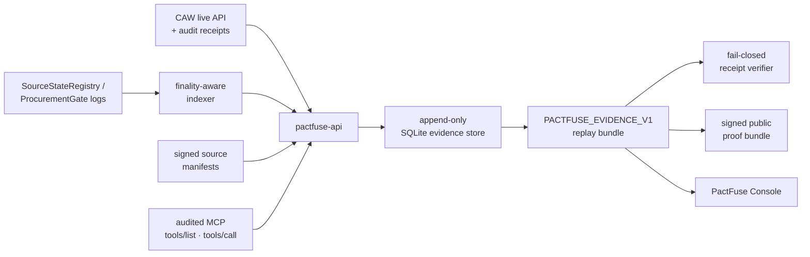

<div align="center">

# ⚡ PactFuse

**A circuit breaker for AI-agent spending.**

PactFuse is a fail-closed, on-chain procurement gate that lets an AI agent spend real funds on **source-bound** tool leases — and **trips the payment before any token moves** the moment a pinned source turns unsafe. Every claim replays cryptographically signed, on-chain evidence.

[**▶ Live Console**](https://pactfuse-console.vercel.app) · [Verify the proof yourself](#-verify-it-yourself) · [How it works](#-how-it-works) · [中文文档](./README.zh-CN.md)

<br/>

[](https://pactfuse-console.vercel.app)
&nbsp;
&nbsp;
&nbsp;

<br/>


</div>

---

## 🧠 TL;DR

> An agent buys a tool lease with funds it controls through a **Cobo Agentic Wallet (CAW)**.
> The spend is **bound to the freshness of its data source**. If the source is challenged before settlement, the on-chain `ProcurementGate` **trips the spend before payment** — `0 moved`. If the source stays clean, the gate **settles on-chain and delivers** the paid artifact, which the agent then consumes through an **audited MCP** surface.
> The whole run is exported as one **replayable, Ed25519-signed proof bundle** that anyone can verify offline — no API, no chain access required.

---

## ✨ Why PactFuse

Agent wallets can already approve tool purchases. But the **value of a tool lease depends on the state of its source** — a code-scan API that was safe at quote time can gain write/file capabilities and turn unsafe *before* the agent pays. PactFuse turns that freshness boundary into an enforceable, on-chain procurement primitive.

|  | |
|---|---|
| 🔌 **Spend before payment, interrupted** | A real on-chain circuit breaker (`ProcurementGate`) cuts the payment path for every spend bound to a challenged source — **before tokens move**, not after. |
| 🔗 **Source-bound by design** | Each spend is pinned to a signed source manifest. Stale source → trip. Fresh source → settle & deliver. |
| 🛡️ **CAW is load-bearing, not decorative** | Every funds-moving call goes **through the CAW API under an approved Pact** (target allowlist + selectors + limits). Wrong-target calls are denied wallet-side and recorded as `live_denied` evidence. The app never holds a raw private key. |
| 🧾 **Evidence over assertions** | Every claim is backed by raw CAW receipts, finalized chain logs, ERC-20 balance deltas, an MCP transcript hash, and a replay verifier — exported as a signed bundle. |
| 🚪 **Fail-closed everywhere** | Missing, pending, fixture, manual, or self-inconsistent evidence keeps `winnerClaimAllowed = false`. There is **no manual override** — the only path to a public claim is passing every live gate in one session. |
| 🎛️ **A demo you can read in 10 seconds** | The [live console](https://pactfuse-console.vercel.app) replays the real session as a single "spend line": wallet → policy → breaker → market, where *where the spend comes to rest* encodes the outcome. |

---

## 🎬 Live Demo

### → **[pactfuse-console.vercel.app](https://pactfuse-console.vercel.app)**

The **PactFuse Console** is a zero-build, dependency-free demo that replays the verified Base Sepolia session. Pick one of three risk scenarios and run it — every step binds to a real evidence row (tx hashes, block numbers, CAW audit evidence):

| Scenario | What you watch | Outcome |
|---|---|---|
| 🔴 **Unsafe source → auto-interrupt** | A pinned source is challenged on-chain; the breaker throws open | `SPEND HALTED` · `0 moved` |
| 🟢 **Fresh source → settle & deliver** | Allowance verified, gate settles, artifact released via MCP lease | `DELIVERED` |
| 🟡 **Wrong target → policy denial** | A call outside the Pact allowlist is refused by CAW server-side | `DENIED` (no tx ever exists) |

`?fail=1` demonstrates the transport-failure / retry path. Full `prefers-reduced-motion`, keyboard, and mobile support included.

---

## 🧩 How It Works

PactFuse models a purchase as a **source-bound lease**:

1. A source issuer registers a **signed source manifest**.
2. A buyer agent registers a **spend bound to that source set** (through CAW).
3. **Source challenged before settlement** → `ProcurementGate` **trips** the spend before any token moves.
4. **Source stays fresh** → the gate **settles** the spend and unlocks a **paid artifact**.
5. The clean lease executes through an **audited MCP** surface bounded to the exact pinned tool manifest.
6. Every step is exported as `PACTFUSE_EVIDENCE_V1` for replay, verification, and Judge Check review.



---

## 🔐 Verified On-Chain Evidence

All values below are from **one clean live session** on Base Sepolia (chain id `84532`), re-verified against the public RPC.

Session `0x4686a9d093cce9159d3b38085b7dab31fcf394488d956850bbc533b478c1965c`

| Item | On-chain |
|---|---|
| Agent wallet (CAW, EVM) | [`0x233bea…be6c`](https://sepolia.basescan.org/address/0x233bea7367aa309d8e8abc4906f7cd7159adbe6c) |
| `ProcurementGate` (the breaker) | [`0x5ea6ca…f89f`](https://sepolia.basescan.org/address/0x5ea6ca349b44c4d5e5c7414ca5e8177b4517f89f) |
| `SourceStateRegistry` | [`0xad8673…063f`](https://sepolia.basescan.org/address/0xad8673a2bbd4f3d45678bd8cd929de70b0bd063f) |
| `PaidArtifactMarket` | [`0x5fffc5…f32a`](https://sepolia.basescan.org/address/0x5fffc5f978d19083f91e8b7224d0975e0663f32a) |
| Payment token (mock ERC-20, mUSD) | [`0x17b27a…3675`](https://sepolia.basescan.org/address/0x17b27ade48c881a562eff03649a9162606ff3675) |
| CAW `approve` tx → gate | [`0x782c1b…68c0e`](https://sepolia.basescan.org/tx/0x782c1b34b1fd7f488cbc04527470e622068b1cd6fc736b9efc6cd1846e768c0e) · block 42758057 |
| CAW `activate_tool` settlement (`SpendSettled` + `Transfer`) | [`0x517acd…23950`](https://sepolia.basescan.org/tx/0x517acd3bfd4ff1fe9bbddd353f5eef4603e1198803c0b66c34a52a7bdde23950) · block 42758072 |
| CAW wrong-target deny (no tx) | op `0x540d73…0efe1`, status `live_denied` |
| Lease execution | run `0x4ddfae…0c41e5`, status `succeeded_live_mcp_transcript` |

The full signed artifacts are checked in under [`docs/evidence/live/0x4686…965c/`](docs/evidence/live/0x4686a9d093cce9159d3b38085b7dab31fcf394488d956850bbc533b478c1965c) (`live-preflight.json`, `public-claim.json`, `proof-bundle.json`, `manifest.json`).

---

## ✅ Verify It Yourself

**Offline — no API, no chain access.** Recomputes every hash and checks the Ed25519 verifier attestation against the trusted key hash:

```sh
PACTFUSE_TRUSTED_PROOF_KEY_HASHES=0x25b4b8faa1bc2ae3984f983f106c465ed607ce2eb5bf4356c000735f7002fec9 \
node scripts/verify-live-artifacts.mjs \
  docs/evidence/live/0x4686a9d093cce9159d3b38085b7dab31fcf394488d956850bbc533b478c1965c
```

Expected: `"ok": true` with `publicClaimHash 0xd624…87c7`, `proofBundleHash 0x01e0…9668`.

**Run the full suites** (233 API · 114 verifier · 7 schema · 5 MCP · 9 contract tests):

```sh
pnpm install && pnpm build && pnpm test && pnpm test:contracts
```

**See fail-closed in action** — the checked-in pending receipt is rejected by the full verifier and only accepted structurally:

```sh
node packages/verifier/pactfuse-verify-receipt.mjs --schema-only docs/evidence/receipt-pack.pending.example.json
node packages/verifier/pactfuse-verify-receipt.mjs            docs/evidence/receipt-pack.pending.example.json
```

---

## 🚀 Quick Start

> Requirements: Node.js ≥ 22, pnpm 10.30, [Foundry](https://book.getfoundry.sh/) for Solidity tests.

```sh
pnpm install
pnpm build
pnpm test
pnpm test:contracts
```

**Run the console** (zero-build, served from the repo root so it can load the checked-in proof artifacts):

```sh
pnpm demo:console
# → http://127.0.0.1:8123/apps/fusebox/live/
```

**Run the API** locally (insecure-token bypass is for local dev only):

```sh
export PACTFUSE_ALLOW_INSECURE_MISSING_ROLE_TOKENS=true
export PACTFUSE_MCP_AUDIT_TOKEN=local-mcp-audit
export PACTFUSE_GATE_INGEST_TOKEN=local-gate-ingest
export PACTFUSE_CAW_INGEST_TOKEN=local-caw-ingest
pnpm dev:api   # http://127.0.0.1:8787  ·  /healthz · /readyz · /api/v1/openapi.json
```

The judge runner starts the backend when possible, prints evidence links, and **exits non-zero while proof gates are still closed** — demonstrating the fail-closed default:

```sh
./demo/run-judge.sh
```

---

## 🧱 Tech Stack

| Layer | Stack |
|---|---|
| **Wallet / custody** | Cobo Agentic Wallet (`@cobo/agentic-wallet`) — Pact policy, contract calls, audit export |
| **Smart contracts** | Solidity + Foundry on Base Sepolia |
| **API** | Hono · Zod · viem · `@noble/curves` · `node:sqlite` (append-only evidence store) · pino |
| **Agent surface** | Model Context Protocol (`@modelcontextprotocol/sdk`) — audited tool leases |
| **Proof** | Canonical-JSON hashing + Ed25519 attestation · fail-closed replay verifier |
| **Console** | Zero-build vanilla ES modules + CSS (no framework, no dependencies) |
| **Tooling** | Turborepo · pnpm workspaces · TypeScript · Vitest · GitHub Actions |
| **Deploy** | Vercel (static console) |

---

## 📁 Project Structure

```
.
├── apps/
│   ├── pactfuse-api/        # Hono API · evidence store · indexer · CAW ingest · verifier adapter · SSE
│   └── fusebox/live/        # PactFuse Console — zero-build evidence-backed demo
├── contracts/               # Foundry: SourceStateRegistry · ProcurementGate · PaidArtifactMarket · SourceFreshGuard
├── packages/
│   ├── evidence-schema/     # Shared Zod schemas + canonical JSON hashing
│   ├── verifier/            # verifyEvidence() + CLI receipt / replay verifier
│   ├── pactfuse-mcp/        # MCP adapter that audits tool calls back into PactFuse
│   └── guard-kit/           # Reusable source-fresh settlement scaffold
├── pact-template/           # Pact templates + A/B/C spend-series renderer
├── docs/evidence/           # Evidence rules, claim gates, and the signed live proof artifacts
└── scripts/                 # live-env-report · live-smoke · verify-live-artifacts · serve-demo
```

---

## 🛡️ Security & Claim Boundaries

PactFuse derives public claims from **evidence, never from pitch preference**. Fresh deployments boot fail-closed (`claimMode=simulated`, `winnerClaimAllowed=false`).

### Claim ledger

| Capability | Status |
| --- | --- |
| CAW-authorized spend — `approve` + `activate_tool` settle through CAW under an approved Pact | ✅ live · Base Sepolia |
| Source-bound trip **before payment** (`ProcurementGate`) | ✅ live |
| On-chain settlement + ERC-20 balance-delta proof | ✅ live · mock ERC-20 |
| Wrong-target policy denial (CAW, server-side) | ✅ live · `live_denied` |
| Audited MCP lease-execution transcript | ✅ live |
| Signed proof bundle + offline re-verification | ✅ live |
| Real-value / official **USDC** settlement | 🔴 not claimed — mock-ERC20 fallback |
| **Mainnet** | 🔴 testnet only (Base Sepolia) |
| Multi-agent (separate buyer/seller) identity | 🔴 single CAW wallet — recorded floor |
| Independent third-party MCP / artifact workload | ⏳ team-operated demo infra |

**What this is — and is explicitly not:**

- ✅ Real CAW authorization + audit receipts, real on-chain `approve`/settlement txs, real policy denial.
- ❌ **Not mainnet.** All execution is on Base Sepolia testnet.
- ❌ **Not official USDC / not real-value settlement.** The official USDC probe failed for this environment; the recorded fallback is a self-deployed mock ERC-20 (mUSD), and the schema **rejects** any attempt to present it as USDC (`live-mock-erc20-fallback`).
- ❌ **Not multi-agent identity.** One CAW owner wallet under one approved Pact.
- ❌ **Not third-party workload.** The MCP/artifact endpoints are team-operated demo infra.
- ❌ **Not proof of issuer honesty.** Issuer-declared source freshness is an explicit trust boundary.

The app never holds a raw private key; funds move only through CAW under an approved Pact. All demo value is testnet-only. See [`docs/evidence/`](docs/evidence) for the claim-mode rules, custody boundary, and receipt-verifier spec.

---

## 🤖 AI Tools & Third-Party Disclosure

Per hackathon rules, everything external is declared.

- **APIs / services**: Cobo Agentic Wallet API (`api.agenticwallet.cobo.com`); Base Sepolia public JSON-RPC; Cloudflare quick tunnels for the team-operated demo MCP/artifact endpoints; GitHub Actions for CI; Vercel for the console.
- **SDKs / libraries**: `@cobo/agentic-wallet`, Hono, Zod, viem, `@noble/curves`, `@modelcontextprotocol/sdk`, pino, Vitest, Turborepo, pnpm, tsx, TypeScript, Foundry.
- **AI tools**: large parts of this codebase were written with AI coding agents **under human direction** — OpenAI Codex (backend) and Anthropic Claude Code (review, release verification, frontend/console, this README). All behavior claims are backed by the machine-verifiable evidence above — the test suites, the fail-closed verifier, and the signed proof bundle are the source of truth, not authorship.

---

## 📄 License

No license file is checked in yet — treat the repository as **all-rights-reserved** until a license is added.

<div align="center">
<br/>
<sub>Built for the AI × Web3 Agentic Builders Hackathon · Cobo Agentic Wallet track · <a href="./README.zh-CN.md">中文文档</a></sub>
</div>
