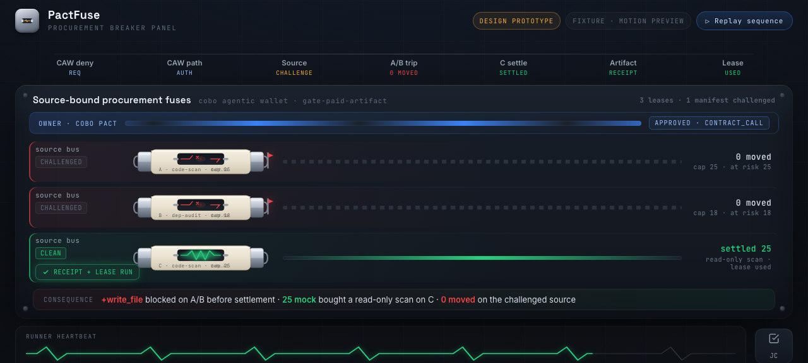
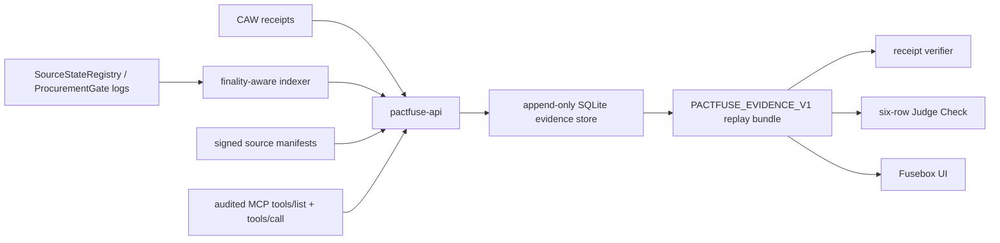

# PactFuse

<p align="center">
  <strong>Source-fresh procurement for agent tool leases.</strong>
</p>

<p align="center">
  PactFuse trips unsafe source-bound spends before payment, settles clean leases through a gate contract, and preserves a replayable evidence bundle for every claim.
</p>

<p align="center">
  
  
  
  
  
</p>



## Contents

- [What Is PactFuse?](#what-is-pactfuse)
- [Why It Exists](#why-it-exists)
- [Highlights](#highlights)
- [Current Claim Status](#current-claim-status)
- [Architecture](#architecture)
- [Quick Start](#quick-start)
- [API Surface](#api-surface)
- [Evidence And Verification](#evidence-and-verification)
- [Configuration](#configuration)
- [Smart Contracts](#smart-contracts)
- [Frontend Preview](#frontend-preview)
- [Development](#development)
- [Documentation](#documentation)
- [Security Model](#security-model)
- [License](#license)

## What Is PactFuse?

PactFuse is a hybrid protocol and evidence system for agentic wallet procurement.

It models a purchase as a source-bound lease:

1. A source issuer registers a signed source manifest.
2. A buyer registers a spend bound to that source set.
3. If the source is challenged before settlement, `ProcurementGate` trips the spend before token movement.
4. If the source stays fresh, the gate settles the spend and unlocks a paid artifact.
5. The clean lease can execute through an audited MCP tool surface.
6. Every step is exported as `PACTFUSE_EVIDENCE_V1` for replay, verification, and Judge Check review.

The repository currently runs in fail-closed prototype mode. Structural proofs and replay checks are implemented; public production claims remain disabled until the live evidence gates pass.

## Why It Exists

Agent wallets can approve tool purchases, but the value of a tool lease depends on source state. A code-scan lease that was safe at quote time may become unsafe before payment if the pinned source gains write or file capabilities.

PactFuse turns that freshness boundary into an enforceable procurement primitive:

- unsafe source -> trip before funds move
- clean source -> settle and deliver
- every claim -> backed by raw receipts, chain logs, MCP transcript hashes, and replay verifier output

## Highlights

- **Fail-closed API**: mutation routes and deep live proof checks require operator or role tokens unless explicitly bypassed for local development.
- **Source freshness gate**: `ProcurementGate` and reusable `SourceFreshGuard` anchor the core on-chain rule.
- **Replayable evidence**: session, events, CAW receipts, artifact preflight, access tokens, MCP calls, lease runs, Judge Check, and verifier output share one `sessionId`.
- **Paged replay index**: large evidence sets expose page roots and `/api/v1/evidence/replay-page`.
- **MCP transcript binding**: clean lease execution is bounded to the exact pinned tool manifest; extra audit frames invalidate the bounded transcript claim.
- **Receipt verifier**: importable verifier plus CLI rejects pending, manual, fixture, blocked, or self-inconsistent evidence.
- **Fusebox preview**: a dark procurement breaker-panel prototype for the intended first-screen product experience.
- **Foundry contracts**: Solidity contracts and tests for source registry, procurement gate, paid artifact market, and second-adopter guard example.

## Current Claim Status

PactFuse is intentionally honest about what is live today.

```text
CLAIM_MODE: simulated
PAYMENT_MODE: mocked
TOKEN_MODE: local-mocked
IDENTITY_MODE: pending
WINNER_CLAIM_ALLOWED: false
```

| Area | Current status | Public claim allowed |
| --- | --- | --- |
| Cobo wallet identity | Pending probe | No |
| Payment settlement | Mocked/local | No real-token claim |
| CAW allowance proof | Implemented with active Pact policy digest/snapshot binding, CAW live approve call evidence, CAW audit allow usage, approve tx receipt, ERC20 `Approval` log, and block-level `allowance` checks in local mocked mode | No public Cobo-payment claim |
| Token balance delta proof | Implemented with finalized `SpendSettled`, prior `caw.allowance.verified`, active Pact policy digest/snapshot binding, CAW `activate_tool` audit usage bound to the settlement tx, ERC20 `Transfer`, and block-level `balanceOf` checks in local mocked mode | No public token-settlement claim |
| Token delivery | Local mocked | No public token-delivery claim |
| Fusebox app | Fixture preview | No proof authority |
| Receipt verifier | Fail-closed verifier with conservative receipt-pack mode and final replay-bundle gates | No public proof claim until live evidence passes |
| Contracts | Built and tested locally | Use as proof anchor only after live deployment evidence |

See [Claim Mode Rules](docs/evidence/claim-mode.md) and [Live vs Fixture Rules](docs/evidence/live-vs-fixture.md) before upgrading any public claim.

## Architecture



### Components

| Path | Purpose |
| --- | --- |
| [apps/pactfuse-api](apps/pactfuse-api) | Hono API, evidence store, worker, indexer, CAW ingest, lease runner, verifier adapter, SSE stream |
| [apps/fusebox](apps/fusebox) | Fixture UI previews for the procurement breaker-panel experience |
| [contracts](contracts) | Foundry contracts for source freshness, procurement settlement, and artifact delivery |
| [packages/evidence-schema](packages/evidence-schema) | Shared Zod schemas and canonical JSON hashing |
| [packages/verifier](packages/verifier) | `verifyEvidence()` plus CLI verifier for receipt packs and replay bundles |
| [packages/pactfuse-mcp](packages/pactfuse-mcp) | Thin MCP adapter that audits tool calls back into PactFuse |
| [packages/guard-kit](packages/guard-kit) | Guard-kit package scaffold for reusable source-fresh settlement adoption |
| [pact-template](pact-template) | Pact templates and A/B/C spend-series renderer |
| [docs/evidence](docs/evidence) | Evidence rules, examples, claim gates, and rerun documentation |
| [research](research) | Design history and architecture reviews |

## Quick Start

### Requirements

- Node.js 22 or newer
- pnpm 10.30.0
- Foundry for Solidity tests

### Install

```sh
pnpm install
```

### Build Everything

```sh
pnpm build
```

### Run Tests

```sh
pnpm test
pnpm test:contracts
```

### Start The API Locally

Local development can use the explicit insecure-token bypass. Do not use this bypass for hosted demos or public services.

```sh
export PACTFUSE_ALLOW_INSECURE_MISSING_ROLE_TOKENS=true
export PACTFUSE_MCP_AUDIT_TOKEN=local-mcp-audit
export PACTFUSE_GATE_INGEST_TOKEN=local-gate-ingest
export PACTFUSE_CAW_INGEST_TOKEN=local-caw-ingest

pnpm dev:api
```

The API listens on `http://127.0.0.1:8787` by default.

```sh
curl http://127.0.0.1:8787/healthz
curl http://127.0.0.1:8787/readyz
curl http://127.0.0.1:8787/api/v1/openapi.json
```

### Run The Judge Script

The judge script starts the backend when possible, prints evidence links, checks the pending receipt example, and exits non-zero until live proof rows are present.

```sh
./demo/run-judge.sh
```

## API Surface

Important `/api/v1` routes:

| Route | Purpose |
| --- | --- |
| `POST /api/v1/sessions` | Create deterministic fail-closed sessions |
| `POST /api/v1/sources/register` | Register signed source metadata |
| `POST /api/v1/sources/challenge` | Record source challenge evidence |
| `POST /api/v1/spends/register-batch` | Register source-bound spends |
| `POST /api/v1/caw/operations/build` | Build CAW operation envelopes |
| `POST /api/v1/caw/live/identity/probe` | Probe live CAW wallet identity evidence |
| `POST /api/v1/caw/live/contracts/call` | Record CAW live approve or `activate_tool` contract-call evidence |
| `POST /api/v1/caw/live/allowances/verify` | Verify CAW approve tx, ERC20 `Approval` log, and on-chain allowance state |
| `POST /api/v1/caw/receipts/ingest` | Ingest raw CAW receipt exports |
| `POST /api/v1/gate/events/ingest` | Ingest gate/indexer events |
| `POST /api/v1/token/balance-deltas/verify` | Verify finalized settlement against CAW allowance proof, ERC20 balance deltas, and matching `Transfer` log |
| `POST /api/v1/artifacts/preflight` | Preflight delivery before quote signing |
| `POST /api/v1/quotes` | Sign mocked or chain-settleable quotes after preflight |
| `POST /api/v1/artifacts/access-token` | Issue bearer-bound artifact access tokens |
| `POST /api/v1/lease/execute` | Execute clean leases through audited MCP JSON-RPC |
| `POST /api/v1/mcp/audit` | Record audited MCP adapter calls |
| `GET /api/v1/evidence/judge-check` | Read the six-row Judge Check |
| `GET /api/v1/evidence/claim-readiness` | Operator-only derivation of current and target claim modes from evidence gates |
| `GET /api/v1/evidence/live-preflight` | Operator-only live provider, production auth, indexer, and claim-readiness blockers before any public claim |
| `GET /api/v1/evidence/public-claim` | Operator-only fail-closed public-claim authorization gate |
| `GET /api/v1/evidence/replay-bundle` | Read `PACTFUSE_EVIDENCE_V1` summary plus embedded replay page proofs |
| `GET /api/v1/evidence/replay-page` | Read paged replay collections |
| `GET /api/v1/evidence/agent-transcript` | Read MCP transcript summary |
| `GET /api/v1/evidence/stream` | SSE evidence stream |

OpenAPI is served at:

```text
/api/v1/openapi.json
```

## Evidence And Verification

Run the receipt verifier against the checked-in pending example:

```sh
node packages/verifier/pactfuse-verify-receipt.mjs --schema-only docs/evidence/receipt-pack.pending.example.json
node packages/verifier/pactfuse-verify-receipt.mjs docs/evidence/receipt-pack.pending.example.json
```

Expected behavior:

- `--schema-only` accepts the pending structure.
- full verifier mode rejects it because the example is pending, not final proof.
- `proofChipAllowed`, `finalVerifierComplete`, and `winnerClaimAllowed` remain `false` until every final replay gate passes.
- `GET /api/v1/evidence/public-claim` requires the operator bearer token and returns `proof_pending` until claim readiness, verifier output, replay hash, and every live evidence gate are simultaneously green.

The replay verifier checks:

- canonical JSON hashes
- event payload hashes and event roots
- CAW raw and canonical receipt bindings
- quote and artifact preflight bindings
- bearer-bound artifact access proofs
- MCP request/response hashes
- exact pinned-manifest lease transcript boundaries
- final replay blockers for live proof providers, CAW identity, wrong-target deny, live quote status, token settlement, Judge Check, and lease execution
- public-claim authorization remains closed unless the backend can emit `authorized_public_claim`
- paged replay roots plus embedded page bodies for large evidence collections
- Judge Check row references

## Configuration

### Local Security

| Variable | Purpose |
| --- | --- |
| `PACTFUSE_DB_PATH` | SQLite database path, defaults to `.pactfuse/pactfuse.sqlite` |
| `PACTFUSE_OPERATOR_TOKEN` | Required operator write token |
| `PACTFUSE_CHALLENGE_SUBMITTER_TOKEN` | Optional challenge-submitter token; falls back to operator token |
| `PACTFUSE_ARTIFACT_SIGNER_TOKEN` | Optional artifact-signer token; falls back to operator token |
| `PACTFUSE_ALLOW_INSECURE_MISSING_ROLE_TOKENS` | Local-only bypass for missing role tokens |
| `PACTFUSE_MCP_AUDIT_TOKEN` | HMAC token for `/api/v1/mcp/audit` |
| `PACTFUSE_GATE_INGEST_TOKEN` | HMAC token for gate event ingest |
| `PACTFUSE_CAW_INGEST_TOKEN` | Bearer token for raw CAW receipt ingest |

### External Integrations

| Variable | Purpose |
| --- | --- |
| `PACTFUSE_CHAIN_RPC_URL` | Enables viem-backed chain reads |
| `PACTFUSE_CHAIN_ID` | Chain id for indexer and provider checks |
| `PACTFUSE_INDEXER_ENABLED` | Enables the chain indexer worker |
| `PACTFUSE_INDEXER_ADDRESS` | Optional indexed contract address |
| `PACTFUSE_INDEXER_TOPICS` | Optional comma-separated topic filter |
| `PACTFUSE_CAW_EXPORT_URL` | HTTPS CAW receipt export source |
| `PACTFUSE_CAW_API_KEY` | CAW export API key |
| `PACTFUSE_CAW_WALLET_ID` | CAW wallet id |
| `PACTFUSE_LEASE_MCP_URL` | MCP JSON-RPC endpoint for clean lease execution |
| `PACTFUSE_LEASE_MCP_TOOL_NAME` | Required lease tool name, defaults to `pactfuse_code_scan` |

## Smart Contracts

Contracts live in [contracts/src](contracts/src):

- `SourceStateRegistry`: issuer-owned source state and challenge events
- `ProcurementGate`: source-bound spend registration, trip, and settlement
- `PaidArtifactMarket`: pending, delivered, and refunded artifact state
- `SourceFreshGuard`: reusable freshness modifier
- `examples/FreshSourceEscrow`: second adopter example outside the purchase path

Run:

```sh
pnpm test:contracts
```

## Frontend Preview

Fusebox is the intended product surface: a procurement breaker panel where challenged source leases trip cold and clean leases settle hot.

Current files are fixtures, not proof authority:

- [Fusebox v2 preview](apps/fusebox/preview/fusebox-v2/index.html)
- [legacy Fusebox preview](apps/fusebox/preview/fusebox/index.html)
- [rendered screenshot](docs/evidence/screenshots/fusebox-v2-prototype.fixture.png)

Production Fusebox must derive state from `/api/v1/evidence/stream` or polling fallback endpoints.

## Development

```sh
pnpm build
pnpm test
pnpm --filter @pactfuse/api test
pnpm --filter @pactfuse/verifier test
pnpm --filter @pactfuse/pactfuse-mcp test
pnpm test:contracts
```

Before publishing a branch or demo:

1. Keep `winnerClaimAllowed=false` unless the claim-mode gates pass.
2. Run `pnpm turbo run build --force`.
3. Run `pnpm turbo run test --force`.
4. Run `pnpm test:contracts`.
5. Confirm fixture, pending, manual, and blocked rows do not appear as public proof.
6. Confirm secrets are not committed.

## Documentation

Start here:

- [Evidence directory](docs/evidence/README.md)
- [Clean rerun plan](docs/evidence/rerun.md)
- [Build slice checklist](docs/evidence/build-slice-checklist.md)
- [Claim mode rules](docs/evidence/claim-mode.md)
- [Mode-lock runbook](docs/evidence/mode-lock-runbook.md)
- [Receipt verifier spec](docs/evidence/receipt-verifier.md)
- [CAW policy vs live values](docs/evidence/caw-policy-vs-live-values.md)
- [Custody boundary](docs/evidence/custody.md)
- [Competitive differentiation](docs/strategy/competitive-differentiation.md)
- [Backend hardening plan](research/pactfuse-backend-w8-hardening-2026-06-10.md)
- [Final technical spec](research/pactfuse-v8-final-technical-spec-2026-06-10.md)
- [Frontend visual lock](research/pactfuse-frontend-w9-visual-elevation-2026-06-11.md)

## Security Model

PactFuse assumes:

- source freshness is issuer-declared
- CAW policy receipts constrain wallet-side operation boundaries
- `ProcurementGate` enforces source freshness and settlement rules
- `PaidArtifactMarket` handles delivery and refund state
- replay bundles are evidence records, not automatic final truth
- final public claims require live identity, payment, token, CAW, chain, artifact, and verifier evidence

PactFuse does not independently prove that a compromised issuer will challenge its own source. That is an explicit trust boundary.

## License

No license file is checked in yet. Treat the repository as all-rights-reserved until a license is added.
