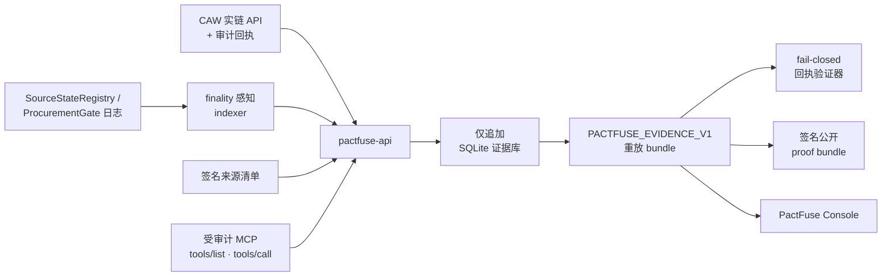

<div align="center">

# ⚡ PactFuse

**为 AI Agent 花钱装上一个"断路器"。**

PactFuse 是一个 fail-closed（默认拒绝）的链上采购闸门：让 AI agent 用自己掌控的资金真实采购**与来源绑定**的工具租约，并在**任何代币转移之前**，于来源变得不安全的瞬间**熔断这笔支付**。每一条声明都由可重放、带密码学签名的链上证据支撑。

[**▶ 在线 Console**](https://pactfuse-console.vercel.app) · [自己验证证据](#-自己验证) · [工作原理](#-工作原理) · [English](./README.md)

<br/>

[](https://pactfuse-console.vercel.app)
&nbsp;
&nbsp;
&nbsp;

<br/>


</div>

---

## 🧠 一句话

> Agent 通过 **Cobo Agentic Wallet (CAW)** 用自己掌控的资金购买一份工具租约。
> 这笔 spend **与其数据来源的新鲜度绑定**：结算前来源被挑战 → 链上 `ProcurementGate` 在**付款之前熔断**，`0 moved`；来源保持干净 → 闸门**链上结算并交付**付费 artifact，agent 再通过**受审计的 MCP** 调用消费它。
> 整个流程被导出为一份**可重放、Ed25519 签名的 proof bundle**，任何人都能**离线验证**——无需 API、无需链访问。

---

## ✨ 为什么需要 PactFuse

Agent 钱包已经可以批准工具采购，但**一份工具租约的价值取决于它来源的状态**——一个在报价时安全的代码扫描 API，可能在 agent 付款*之前*获得写入/文件能力而变得不安全。PactFuse 把这条"新鲜度边界"变成了一个可强制执行的链上采购原语。

|  | |
|---|---|
| 🔌 **付款前熔断** | 一个真正的链上断路器（`ProcurementGate`）会在**代币转移之前**（而非之后）切断每一笔绑定到被挑战来源的 spend 的付款路径。 |
| 🔗 **来源绑定** | 每笔 spend 都钉在一份签名的来源清单上。来源过期 → 熔断；来源新鲜 → 结算并交付。 |
| 🛡️ **CAW 是承重墙,不是装饰** | 每一次动资金的调用都**经由 CAW API、在已批准的 Pact 下**执行（目标白名单 + 函数选择器 + 限额）。错误目标的调用会被钱包侧拒绝，并记录为 `live_denied` 证据。应用从不持有裸私钥。 |
| 🧾 **用证据,而非断言** | 每条声明都由原始 CAW 回执、已最终确定的链上日志、ERC-20 余额变化、MCP transcript 哈希与重放验证器支撑——并导出为签名 bundle。 |
| 🚪 **处处 fail-closed** | 缺失、待定、fixture、人工或自相矛盾的证据都会让 `winnerClaimAllowed = false`。**没有人工 override**——通往公开声明的唯一路径,是在一个 session 内通过每一道实链闸门。 |
| 🎛️ **10 秒就能读懂的 Demo** | [在线 Console](https://pactfuse-console.vercel.app) 把真实 session 重放成一条"花费线":钱包 → 策略 → 断路器 → 市场,而*花费最终停在哪里*就编码了结果。 |

---

## 🎬 在线 Demo

### → **[pactfuse-console.vercel.app](https://pactfuse-console.vercel.app)**

**PactFuse Console** 是一个零构建、零依赖的 Demo,重放已验证的 Base Sepolia session。选择三个风险场景之一并运行——每一步都绑定到真实证据行(交易哈希、区块号、CAW 审计证据):

| 场景 | 你会看到 | 结果 |
|---|---|---|
| 🔴 **不安全来源 → 自动熔断** | 钉住的来源在链上被挑战,断路器张开跳闸 | `SPEND HALTED` · `0 moved` |
| 🟢 **新鲜来源 → 结算并交付** | 额度被验证,闸门结算,artifact 经 MCP 租约释放 | `DELIVERED` |
| 🟡 **错误目标 → 策略拒绝** | Pact 白名单之外的调用被 CAW 服务端拒绝 | `DENIED`(从不产生交易) |

`?fail=1` 演示传输失败 / 重试路径。完整支持 `prefers-reduced-motion`、键盘操作与移动端。

---

## 🧩 工作原理

PactFuse 把一次采购建模为一份**来源绑定的租约**:

1. 来源发行方注册一份**签名的来源清单**。
2. 买方 agent 注册一笔**绑定到该来源集合的 spend**(经由 CAW)。
3. **结算前来源被挑战** → `ProcurementGate` 在任何代币转移之前**熔断**这笔 spend。
4. **来源保持新鲜** → 闸门**结算**这笔 spend 并解锁一份**付费 artifact**。
5. 这份干净的租约通过一个**受审计的 MCP** 表面执行,严格限定在钉住的工具清单内。
6. 每一步都导出为 `PACTFUSE_EVIDENCE_V1`,用于重放、验证与 Judge Check 审阅。



---

## 🔐 已验证的链上证据

下列数值均来自 Base Sepolia(chain id `84532`)上的**一个干净 live session**,并已对公共 RPC 重新核验。

Session `0x4686a9d093cce9159d3b38085b7dab31fcf394488d956850bbc533b478c1965c`

| 项目 | 链上 |
|---|---|
| Agent 钱包(CAW, EVM) | [`0x233bea…be6c`](https://sepolia.basescan.org/address/0x233bea7367aa309d8e8abc4906f7cd7159adbe6c) |
| `ProcurementGate`(断路器) | [`0x5ea6ca…f89f`](https://sepolia.basescan.org/address/0x5ea6ca349b44c4d5e5c7414ca5e8177b4517f89f) |
| `SourceStateRegistry` | [`0xad8673…063f`](https://sepolia.basescan.org/address/0xad8673a2bbd4f3d45678bd8cd929de70b0bd063f) |
| `PaidArtifactMarket` | [`0x5fffc5…f32a`](https://sepolia.basescan.org/address/0x5fffc5f978d19083f91e8b7224d0975e0663f32a) |
| 支付代币(mock ERC-20, mUSD) | [`0x17b27a…3675`](https://sepolia.basescan.org/address/0x17b27ade48c881a562eff03649a9162606ff3675) |
| CAW `approve` 交易 → 闸门 | [`0x782c1b…68c0e`](https://sepolia.basescan.org/tx/0x782c1b34b1fd7f488cbc04527470e622068b1cd6fc736b9efc6cd1846e768c0e) · block 42758057 |
| CAW `activate_tool` 结算(`SpendSettled` + `Transfer`) | [`0x517acd…23950`](https://sepolia.basescan.org/tx/0x517acd3bfd4ff1fe9bbddd353f5eef4603e1198803c0b66c34a52a7bdde23950) · block 42758072 |
| CAW 错误目标拒绝(无交易) | op `0x540d73…0efe1`,状态 `live_denied` |
| 租约执行 | run `0x4ddfae…0c41e5`,状态 `succeeded_live_mcp_transcript` |

完整的签名 artifacts 已 check-in 在 [`docs/evidence/live/0x4686…965c/`](docs/evidence/live/0x4686a9d093cce9159d3b38085b7dab31fcf394488d956850bbc533b478c1965c)(`live-preflight.json`、`public-claim.json`、`proof-bundle.json`、`manifest.json`)。

---

## ✅ 自己验证

**离线——无需 API、无需链访问。** 重算每一个哈希,并对照可信 key 哈希校验 Ed25519 验证器签名:

```sh
PACTFUSE_TRUSTED_PROOF_KEY_HASHES=0x25b4b8faa1bc2ae3984f983f106c465ed607ce2eb5bf4356c000735f7002fec9 \
node scripts/verify-live-artifacts.mjs \
  docs/evidence/live/0x4686a9d093cce9159d3b38085b7dab31fcf394488d956850bbc533b478c1965c
```

期望:`"ok": true`,且 `publicClaimHash 0xd624…87c7`、`proofBundleHash 0x01e0…9668`。

**运行完整测试**(233 API · 114 verifier · 7 schema · 5 MCP · 9 合约):

```sh
pnpm install && pnpm build && pnpm test && pnpm test:contracts
```

**亲眼看 fail-closed**——check-in 的待定回执会被完整验证器拒绝,只在结构上被接受:

```sh
node packages/verifier/pactfuse-verify-receipt.mjs --schema-only docs/evidence/receipt-pack.pending.example.json
node packages/verifier/pactfuse-verify-receipt.mjs            docs/evidence/receipt-pack.pending.example.json
```

---

## 🚀 快速开始

> 环境要求:Node.js ≥ 22、pnpm 10.30、用于 Solidity 测试的 [Foundry](https://book.getfoundry.sh/)。

```sh
pnpm install
pnpm build
pnpm test
pnpm test:contracts
```

**运行 Console**(零构建;从仓库根目录提供服务,以便加载 check-in 的 proof artifacts):

```sh
pnpm demo:console
# → http://127.0.0.1:8123/apps/fusebox/live/
```

**本地运行 API**(insecure-token 旁路仅用于本地开发):

```sh
export PACTFUSE_ALLOW_INSECURE_MISSING_ROLE_TOKENS=true
export PACTFUSE_MCP_AUDIT_TOKEN=local-mcp-audit
export PACTFUSE_GATE_INGEST_TOKEN=local-gate-ingest
export PACTFUSE_CAW_INGEST_TOKEN=local-caw-ingest
pnpm dev:api   # http://127.0.0.1:8787  ·  /healthz · /readyz · /api/v1/openapi.json
```

评委一键脚本会尽量启动后端、打印证据链接,并在 proof 闸门仍关闭时**以非零码退出**——演示 fail-closed 默认:

```sh
./demo/run-judge.sh
```

---

## 🧱 技术栈

| 层 | 技术 |
|---|---|
| **钱包 / 托管** | Cobo Agentic Wallet(`@cobo/agentic-wallet`)——Pact 策略、合约调用、审计导出 |
| **智能合约** | Solidity + Foundry,部署于 Base Sepolia |
| **API** | Hono · Zod · viem · `@noble/curves` · `node:sqlite`(仅追加证据库)· pino |
| **Agent 表面** | Model Context Protocol(`@modelcontextprotocol/sdk`)——受审计的工具租约 |
| **证明** | 规范 JSON 哈希 + Ed25519 签名 · fail-closed 重放验证器 |
| **Console** | 零构建原生 ES 模块 + CSS(无框架、无依赖) |
| **工程** | Turborepo · pnpm workspaces · TypeScript · Vitest · GitHub Actions |
| **部署** | Vercel(静态 Console) |

---

## 📁 目录结构

```
.
├── apps/
│   ├── pactfuse-api/        # Hono API · 证据库 · indexer · CAW ingest · 验证器适配 · SSE
│   └── fusebox/live/        # PactFuse Console —— 零构建、证据驱动的 Demo
├── contracts/               # Foundry:SourceStateRegistry · ProcurementGate · PaidArtifactMarket · SourceFreshGuard
├── packages/
│   ├── evidence-schema/     # 共享 Zod schema + 规范 JSON 哈希
│   ├── verifier/            # verifyEvidence() + CLI 回执/重放验证器
│   ├── pactfuse-mcp/        # 把工具调用审计回 PactFuse 的 MCP 适配器
│   └── guard-kit/           # 可复用的 source-fresh 结算脚手架
├── pact-template/           # Pact 模板 + A/B/C spend 系列渲染器
├── docs/evidence/           # 证据规则、claim 闸门,以及签名的 live proof artifacts
└── scripts/                 # live-env-report · live-smoke · verify-live-artifacts · serve-demo
```

---

## 🛡️ 安全与声明边界

PactFuse 的公开声明**只来自证据,绝不来自宣传偏好**。全新部署默认 fail-closed 启动(`claimMode=simulated`、`winnerClaimAllowed=false`)。

### 声明台账

| 能力 | 状态 |
| --- | --- |
| CAW 授权的支付 —— `approve` + `activate_tool` 在已批准 Pact 下经 CAW 结算 | ✅ 实链 · Base Sepolia |
| 付款前的来源绑定熔断(`ProcurementGate`) | ✅ 实链 |
| 链上结算 + ERC-20 余额变化证明 | ✅ 实链 · mock ERC-20 |
| 错误目标策略拒绝(CAW 服务端) | ✅ 实链 · `live_denied` |
| 受审计的 MCP 租约执行 transcript | ✅ 实链 |
| 签名 proof bundle + 离线复验 | ✅ 实链 |
| 真实价值 / 官方 **USDC** 结算 | 🔴 未声明 —— mock-ERC20 回退 |
| **主网** | 🔴 仅测试网(Base Sepolia) |
| 多 agent(买卖方分离)身份 | 🔴 单 CAW 钱包 —— 记录的 floor |
| 独立第三方 MCP / artifact 工作负载 | ⏳ 团队自运营 Demo 基础设施 |

**它是什么——以及明确不是什么:**

- ✅ 真实的 CAW 授权 + 审计回执、真实的链上 `approve`/结算交易、真实的策略拒绝。
- ❌ **非主网。** 全部执行在 Base Sepolia 测试网。
- ❌ **非官方 USDC、非真实价值结算。** 官方 USDC 探测在该环境失败;记录的回退是自部署的 mock ERC-20(mUSD),且 schema **拒绝**任何把它当作 USDC 呈现的企图(`live-mock-erc20-fallback`)。
- ❌ **非多 agent 身份。** 一个 CAW owner 钱包、一份已批准 Pact。
- ❌ **非第三方工作负载。** MCP/artifact 端点是团队自运营的 Demo 基础设施。
- ❌ **不证明发行方诚实。** 发行方自声明的来源新鲜度是一条明确的信任边界。

应用从不持有裸私钥;资金只在已批准 Pact 下经由 CAW 移动。所有 Demo 价值仅限测试网。claim-mode 规则、托管边界与回执验证器规范见 [`docs/evidence/`](docs/evidence)。

---

## 🤖 AI 工具与第三方声明

按 hackathon 规则,所有外部依赖均如实声明。

- **API / 服务**:Cobo Agentic Wallet API(`api.agenticwallet.cobo.com`);Base Sepolia 公共 JSON-RPC;团队自运营 Demo MCP/artifact 端点用的 Cloudflare quick tunnels;CI 用 GitHub Actions;Console 用 Vercel。
- **SDK / 库**:`@cobo/agentic-wallet`、Hono、Zod、viem、`@noble/curves`、`@modelcontextprotocol/sdk`、pino、Vitest、Turborepo、pnpm、tsx、TypeScript、Foundry。
- **AI 工具**:本仓库的大部分代码是在**人类指导下**由 AI 编码 agent 编写的——OpenAI Codex(后端)与 Anthropic Claude Code(审查、发布验证、前端/Console、本 README)。所有行为声明都由上面那些机器可验证的证据支撑——测试套件、fail-closed 验证器与签名 proof bundle 才是事实来源,而非作者身份。

---

## 📄 许可证

仓库尚未加入 license 文件——在添加 license 之前,请视为**保留所有权利(all-rights-reserved)**。

<div align="center">
<br/>
<sub>为 AI × Web3 Agentic Builders Hackathon · Cobo Agentic Wallet 赛道而构建 · <a href="./README.md">English</a></sub>
</div>
