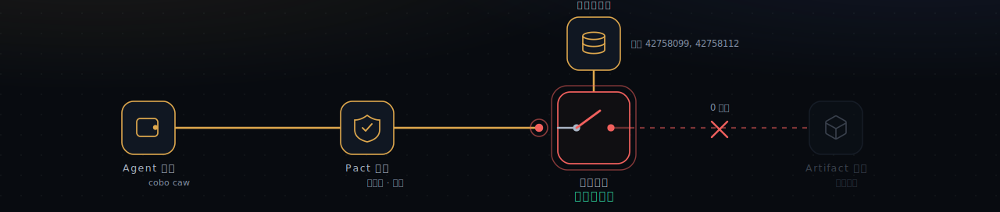
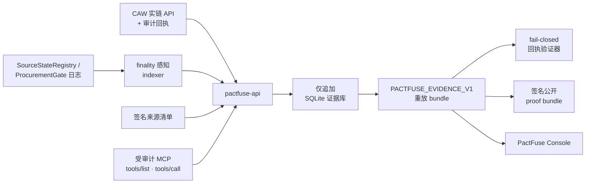

<div align="center">

# ⚡ PactFuse

**为 AI Agent 花钱装上一个 fail-closed 的"断路器"。**

PactFuse 在**付款的那一刻**于链上重新核验 Agent 要买的东西,一旦来源变得不安全,就在**任何代币转移之前**切断这笔支付。每一条声明都由可重放、带签名的链上证据支撑,而且你能实时复验。

[**▶ 在线 Console**](https://pactfuse-console.vercel.app) · [自己验证](#-自己验证) · [工作原理](#-工作原理) · [English](./README.md)

<br/>

[](https://pactfuse-console.vercel.app)
&nbsp;[](https://github.com/beautifulrem/PactFuse/actions/workflows/ci.yml)
&nbsp;
&nbsp;
&nbsp;
&nbsp;[](LICENSE)

<br/>



</div>

---

## 🔥 痛点

AI Agent 开始自己花钱了(买数据、模型、工具、算力),用的是像 **Cobo Agentic Wallet (CAW)** 这样的钱包。但 Agent 买的东西,安全性取决于它的**来源**,而来源可能在"**决定买**"到"**真正付款**"之间变坏。

这个间隙(决定时检查、付款时使用)是一个典型的 TOCTOU(检查与使用时间不一致)漏洞,也正是今天真金白银在损失的地方:

- 预言机价格刚被操纵,机器人就照着它执行;
- 供应商银行账号在发票审批到打款之间被掉包(BEC 诈骗);
- 某个依赖包或模型刚被拉进来,就被标记为恶意(CVE、后门)。

只在决定时检查一次远远不够。**必须在钱要动的那一刻再查一次,有变化就拒绝。**

## ✅ PactFuse 做什么

PactFuse 把每一笔 spend 在链上与它的来源绑定,然后在**付款瞬间**重新校验新鲜度:

- **来源被挑战 → 熔断**:链上 `ProcurementGate` 在任何代币转移前切断付款(`0 moved`);
- **来源干净 → 结算**:闸门在链上付款并释放付费 artifact,经受审计的 MCP 调用消费;
- **错误目标 → 拒绝**:钱包策略层在调用到达链之前就拒绝它。

每次运行都导出一份可重放、Ed25519 签名的 proof bundle,而[在线 console](https://pactfuse-console.vercel.app) 还会在你的浏览器里对公共链**实时复验**它。

> **一句话核心:**别再信"我决定时它是安全的";让付款本身取决于来源**此刻**是否安全。

## 🧱 两道执行层

| 层 | 运行在哪 | 执行什么 | 失败时 |
|---|---|---|---|
| **Pact 策略**(CAW) | 链下,签名之前 | 准不准付:目标白名单、函数选择器、参数、用量限额 | 错误目标 → `live_denied`,从不产生交易 |
| **采购闸门 + 来源登记表** | 链上,付款调用时 | 绑定的来源是否仍新鲜 | 来源被挑战 → 熔断,`0 moved` |

一软一硬:一层灵活(策略、链下、上链前就拒),一层可验证(合约、链上、最后一刻兜底)。两者都 fail-closed:任何缺失或不安全,都等于"不付"。

---

## 🎬 在线 Demo

### → **[pactfuse-console.vercel.app](https://pactfuse-console.vercel.app)**

一个零构建、零依赖的 console,重放已验证的 Base Sepolia session。选择三个风险场景之一并运行;每一步都绑定到真实证据行(交易哈希、区块号、CAW 审计证据):

| 场景 | 你会看到 | 结果 |
|---|---|---|
| 🔴 **不安全来源 → 自动熔断** | 钉住的来源在链上被挑战,断路器张开跳闸 | `SPEND HALTED` · `0 moved` |
| 🟢 **新鲜来源 → 结算并交付** | 额度被验证,闸门结算,artifact 经 MCP 租约释放 | `DELIVERED` |
| 🟡 **错误目标 → 策略拒绝** | Pact 白名单之外的调用被 CAW 服务端拒绝 | `DENIED`(从不产生交易) |

**它不只是重放。** Console 会当着你的面、无需密钥地读取实时链:

- **自检**(按 `T`)从公共 Base Sepolia RPC 重新拉取每一笔真实交易,显示它此刻**仍在链上确认**(数万个确认)。
- **实时状态**(按 `G`)用 `eth_call` 直接读闸门和登记表:受挑战来源返回 `Challenged`、绑定它的支付返回 `Tripped`、干净支付返回 `Settled`。

打开浏览器 Network 面板,就能看到真实的 RPC 调用。无后端、无密钥,除了链本身什么都不用信。(`?fail=1` 演示传输中断 / 重试;完整支持 `prefers-reduced-motion`、键盘与移动端。)

---

## 🧩 工作原理

PactFuse 把一次采购建模为一份**来源绑定的租约**:

1. 来源发行方在 `SourceStateRegistry` 注册一份**签名的来源清单**。
2. 买方 agent 经由 CAW 注册一笔**绑定到该来源集合的 spend**。注册只是把条款钉上链,钱还没动。
3. 在付款调用时,闸门重新核验绑定的来源:
   - **结算前被挑战** → `ProcurementGate` 在任何代币转移前**熔断**这笔 spend;
   - **仍然新鲜** → 闸门**结算**并解锁一份**付费 artifact**。
4. 这份干净的租约通过一个**受审计的 MCP** 表面执行,严格限定在钉住的工具清单内。
5. 每一步都导出为 `PACTFUSE_EVIDENCE_V1`,用于重放、离线验证与 Judge Check 审阅。



---

## 🌍 适用场景

只要"自主付款依赖一个、可被外部权威在决定与结算之间标记为不安全的来源",这套模式就适用:

- **链上机器人 / DeFi:** 清算或套利 bot 基于一个在结算前被操纵的预言机价格执行。把支付挂在预言机的新鲜度上,它就会熔断,而不是照着被污染的价格成交。
- **应付账款自动化 / BEC 诈骗:** 供应商银行账号在发票审批到打款之间被掉包。把放款绑定到收款账户的背书,被标记的账户就会让转账停下。
- **软件 / AI 供应链:** 某个包或模型刚被拉进来,就被标为恶意(CVE、后门)。把采购绑定到 artifact 发行方的背书,被吊销的来源就会拒付。
- **Agent 商业 / A2A:** Agent 给一个在下单到结账之间被标欺诈的商户(或另一个 Agent)付款,或被(提示注入)诱导指向白名单外的目标。新鲜度闸门熔断前者;Pact 策略在上链前拒绝后者。

与本仓库 live demo 最贴合的是供应链那一类:Agent 购买一份来源绑定的工具租约,而来源可能在付款前被挑战。

---

## 🔐 已验证的链上证据

下列数值均来自 Base Sepolia(chain id `84532`)上的**一个干净 live session**,均可对公共 RPC 复验。

Session `0x4686a9d093cce9159d3b38085b7dab31fcf394488d956850bbc533b478c1965c`

| 项目 | 链上 |
|---|---|
| Agent 钱包(CAW, EVM) | [`0x233bea…be6c`](https://sepolia.basescan.org/address/0x233bea7367aa309d8e8abc4906f7cd7159adbe6c) |
| `ProcurementGate`(断路器) | [`0x5ea6ca…f89f`](https://sepolia.basescan.org/address/0x5ea6ca349b44c4d5e5c7414ca5e8177b4517f89f) |
| `SourceStateRegistry` | [`0xad8673…063f`](https://sepolia.basescan.org/address/0xad8673a2bbd4f3d45678bd8cd929de70b0bd063f) |
| `PaidArtifactMarket` | [`0x5fffc5…f32a`](https://sepolia.basescan.org/address/0x5fffc5f978d19083f91e8b7224d0975e0663f32a) |
| 支付代币(mock ERC-20, mUSD) | [`0x17b27a…3675`](https://sepolia.basescan.org/address/0x17b27ade48c881a562eff03649a9162606ff3675) |
| CAW `approve` 交易 → 闸门 | [`0x782c1b…68c0e`](https://sepolia.basescan.org/tx/0x782c1b34b1fd7f488cbc04527470e622068b1cd6fc736b9efc6cd1846e768c0e) · block 42758057 |
| CAW `activate_tool` 结算(`SpendSettled` + `Transfer`) | [`0x517acd…23950`](https://sepolia.basescan.org/tx/0x517acd3bfd4ff1fe9bbddd353f5eef4603e1198803c0b66c34a52a7bdde23950) · block 42758072 |
| CAW 错误目标拒绝(无交易) | op `0x540d73…0efe1`,状态 `live_denied` |
| 租约执行 | run `0x4ddfae…0c41e5`,状态 `succeeded_live_mcp_transcript` |

完整的签名 artifacts 已 check-in 在 [`docs/evidence/live/0x4686…965c/`](docs/evidence/live/0x4686a9d093cce9159d3b38085b7dab31fcf394488d956850bbc533b478c1965c)(`live-preflight.json`、`public-claim.json`、`proof-bundle.json`、`manifest.json`)。

---

## ✅ 自己验证

三种相互独立的方式,严格程度递增:

**1. 在浏览器里(实时链、无密钥)。** 打开 [console](https://pactfuse-console.vercel.app),按 `T`(自检)和 `G`(实时状态),在 Network 面板看真实的 Base Sepolia RPC 调用重新确认证据此刻仍在链上。

**2. 离线(无需 API、无需链访问)。** 重算每一个哈希,并对照可信 key 哈希校验 Ed25519 验证器签名:

```sh
PACTFUSE_TRUSTED_PROOF_KEY_HASHES=0x25b4b8faa1bc2ae3984f983f106c465ed607ce2eb5bf4356c000735f7002fec9 \
node scripts/verify-live-artifacts.mjs \
  docs/evidence/live/0x4686a9d093cce9159d3b38085b7dab31fcf394488d956850bbc533b478c1965c
```

期望:`"ok": true`,且 `publicClaimHash 0xd624…87c7`、`proofBundleHash 0x01e0…9668`。

**3. 运行完整测试**(233 API · 114 verifier · 7 schema · 5 MCP · 9 合约):

```sh
pnpm install && pnpm build && pnpm test && pnpm test:contracts
```

亲眼看 fail-closed:check-in 的待定回执会被完整验证器拒绝,只在结构上被接受:

```sh
node packages/verifier/pactfuse-verify-receipt.mjs --schema-only docs/evidence/receipt-pack.pending.example.json
node packages/verifier/pactfuse-verify-receipt.mjs            docs/evidence/receipt-pack.pending.example.json
```

---

## 🚀 快速开始

> 环境要求:Node.js ≥ 22、pnpm 10.30、用于 Solidity 测试的 [Foundry](https://book.getfoundry.sh/)。

```sh
pnpm install
pnpm build
pnpm test
pnpm test:contracts
```

**运行 Console**(零构建;从仓库根目录提供服务,以便加载 check-in 的 proof artifacts):

```sh
pnpm demo:console
# → http://127.0.0.1:8123/apps/fusebox/live/
```

**本地运行 API**(insecure-token 旁路仅用于本地开发):

```sh
export PACTFUSE_ALLOW_INSECURE_MISSING_ROLE_TOKENS=true
export PACTFUSE_MCP_AUDIT_TOKEN=local-mcp-audit
export PACTFUSE_GATE_INGEST_TOKEN=local-gate-ingest
export PACTFUSE_CAW_INGEST_TOKEN=local-caw-ingest
pnpm dev:api   # http://127.0.0.1:8787  ·  /healthz · /readyz · /api/v1/openapi.json
```

评委一键脚本会尽量启动后端、打印证据链接,并在 proof 闸门仍关闭时**以非零码退出**,以此演示 fail-closed 默认:

```sh
./demo/run-judge.sh
```

---

## 🧱 技术栈

| 层 | 技术 |
|---|---|
| **钱包 / 托管** | Cobo Agentic Wallet(`@cobo/agentic-wallet`):Pact 策略、合约调用、审计导出 |
| **智能合约** | Solidity + Foundry,部署于 Base Sepolia |
| **API** | Hono · Zod · viem · `@noble/curves` · `node:sqlite`(仅追加证据库)· pino |
| **Agent 表面** | Model Context Protocol(`@modelcontextprotocol/sdk`):受审计的工具租约 |
| **证明** | 规范 JSON 哈希 + Ed25519 签名 · fail-closed 重放验证器 |
| **Console** | 零构建原生 ES 模块 + CSS(无框架、无依赖) |
| **工程** | Turborepo · pnpm workspaces · TypeScript · Vitest · GitHub Actions |
| **部署** | Vercel(静态 Console) |

---

## 📁 目录结构

```
.
├── apps/
│   ├── pactfuse-api/        # Hono API · 证据库 · indexer · CAW ingest · 验证器适配 · SSE
│   └── fusebox/live/        # PactFuse Console:零构建、证据驱动的 Demo
├── contracts/               # Foundry:SourceStateRegistry · ProcurementGate · PaidArtifactMarket · SourceFreshGuard
├── packages/
│   ├── evidence-schema/     # 共享 Zod schema + 规范 JSON 哈希
│   ├── verifier/            # verifyEvidence() + CLI 回执/重放验证器
│   ├── pactfuse-mcp/        # 把工具调用审计回 PactFuse 的 MCP 适配器
│   └── guard-kit/           # 可复用的 source-fresh 结算脚手架
├── pact-template/           # Pact 模板 + A/B/C spend 系列渲染器
├── docs/evidence/           # 证据规则、claim 闸门,以及签名的 live proof artifacts
└── scripts/                 # live-env-report · live-smoke · verify-live-artifacts · serve-demo
```

---

## 🛡️ 信任模型与声明边界

PactFuse 的公开声明**只来自证据,绝不来自宣传偏好**。全新部署默认 fail-closed 启动(`claimMode=simulated`、`winnerClaimAllowed=false`)。**没有人工 override**:通往公开声明的唯一路径,是在一个 session 内通过每一道实链闸门。

### 声明台账

| 能力 | 状态 |
| --- | --- |
| CAW 授权的支付:`approve` + `activate_tool` 在已批准 Pact 下经 CAW 结算 | ✅ 实链 · Base Sepolia |
| 付款前的来源绑定熔断(`ProcurementGate`) | ✅ 实链 |
| 链上结算 + ERC-20 余额变化证明 | ✅ 实链 · mock ERC-20 |
| 错误目标策略拒绝(CAW 服务端) | ✅ 实链 · `live_denied` |
| 受审计的 MCP 租约执行 transcript | ✅ 实链 |
| 签名 proof bundle + 离线复验 | ✅ 实链 |
| 真实价值 / 官方 **USDC** 结算 | 🔴 未声明 · mock-ERC20 回退 |
| **主网** | 🔴 仅测试网(Base Sepolia) |
| 多 agent(买卖方分离)身份 | 🔴 单 CAW 钱包(记录的 floor) |
| 独立第三方 MCP / artifact 工作负载 | ⏳ 团队自运营 Demo 基础设施 |

**它是什么,以及明确不是什么:**

- ✅ 真实的 CAW 授权 + 审计回执、真实的链上 `approve` / 结算交易、真实的策略拒绝。
- ❌ **非主网。** 全部执行在 Base Sepolia 测试网。
- ❌ **非官方 USDC、非真实价值结算。** 官方 USDC 探测在该环境失败;记录的回退是自部署的 mock ERC-20(mUSD),且 schema **拒绝**任何把它当作 USDC 呈现的企图(`live-mock-erc20-fallback`)。
- ❌ **非多 agent 身份。** 一个 CAW owner 钱包、一份已批准 Pact。
- ❌ **非第三方工作负载。** MCP / artifact 端点是团队自运营的 Demo 基础设施。
- ❌ **不证明发行方诚实。** 发行方自声明的来源新鲜度是一条明确的信任边界(只有来源的注册发行方能挑战或吊销它;生产硬化方向是多挑战者 / 带质押的 watcher 网络)。

应用从不持有裸私钥;资金只在已批准 Pact 下经由 CAW 移动。所有 Demo 价值仅限测试网。claim-mode 规则、托管边界与回执验证器规范见 [`docs/evidence/`](docs/evidence)。

---

## ❓ 常见问题

**什么是"来源(source)"?** 一次采购所依赖的外部东西(数据源、模型、API、artifact 的出处)。每个来源都有一个链上身份(`sourceHash`)和一个在 `SourceStateRegistry` 里的状态:`Active`(活跃)、`Challenged`(已挑战)或 `Revoked`(已吊销)。

**谁能把来源标成不安全?** 链上只有该来源**注册的 issuer** 能 `challengeSource` / `revokeSource`(其他人会 revert)。生产中这个 issuer 是来源的权威方(供应方自报、第三方 watcher,或治理多签);硬化方向是多挑战者 / 质押 watcher 网络。PactFuse 负责**执行**(可证明、fail-closed 的拦截);"谁有资格标记"是上层可插拔的信任选择。

**检查发生在决定时还是付款时?** 只在付款时。`registerSpend` 只是把条款钉上链,不查新鲜度;新鲜度检查(`_allSourcesActive`)在 `activateTool`、也就是资金要动的那一刻执行。这堵住了"决定 vs 付款"(TOCTOU)间隙:登记之后才变坏的来源,付款时仍会熔断。

**Pact 策略是智能合约吗?** 不是。Pact 是一份声明式钱包策略(目标白名单 + 参数 + 限额),由 Cobo Agentic Wallet 在签名之前**链下执行**;它的摘要被钉进证据以供审计。链上合约是闸门、登记表、市场和代币。

**这是主网 / 真钱吗?** 不是。全部在 Base Sepolia 测试网,用自部署的 mock ERC-20(mUSD)结算,且 schema 拒绝把它当 USDC 呈现。详见上面的声明台账。

---

## 🔌 第三方声明

按 hackathon 规则,所有外部依赖均如实声明。

- **API / 服务**:Cobo Agentic Wallet API(`api.agenticwallet.cobo.com`);Base Sepolia 公共 JSON-RPC;团队自运营 Demo MCP / artifact 端点用的 Cloudflare quick tunnels;CI 用 GitHub Actions;Console 用 Vercel。
- **SDK / 库**:`@cobo/agentic-wallet`、Hono、Zod、viem、`@noble/curves`、`@modelcontextprotocol/sdk`、pino、Vitest、Turborepo、pnpm、tsx、TypeScript、Foundry。

---

## 📄 许可证

以 [MIT 许可证](LICENSE) 发布。

<div align="center">
<br/>
<sub>为 AI × Web3 Agentic Builders Hackathon · Cobo Agentic Wallet 赛道而构建 · <a href="./README.md">English</a></sub>
</div>
